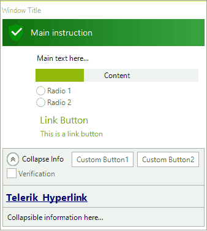

# Task Dialog

**RadTaskDialog** is a themable alternative of the windows [dialog box](https://docs.microsoft.com/en-us/windows/win32/controls/task-dialogs-overview) and the newly released TaskDialog for .NET 5. The dialog box is a window that allows users to perform a command, ask the users a question, provide users with information or indicate the progress of an ongoing task. 





**RadTaskDialog** represents an extended version of the standard System.Windows.Forms.**MessageBox** and respectively the **RadMessageBox**. 

 

## Key Features

Here are a few of the **RadTaskDialog**'s main features:

* **Auto-Size**: The size of the window is based on the content added to the page.
* **Paging**: Provides navigation to a new page (by reconstructing the dialog from the current properties). The task dialog can act as a small wizard with several pages. Microsoft recommends to use no more than three pages.
* **Supported Elements**: Supports all of the native Task Dialog elements (like custom buttons, command links, progress bar, radio buttons, check box, expanded area, footer). The task dialog supports a wide range of predefined elements which can be assigned to the page and will be automatically arranged with no need to write any layout logic.
* **Icons**: In addition to the standard icons which indicate *Error*, *Warning*, *Information*, the task dialog has green, yellow, red, gray or blue bar over the whole heading/title background. Additionally, custom icons and images are also supported out of the box.
* **Modal vs Non Modal**: Can be shown modal or non-modal, via the **ShowDialog** or the **Show** methods.
* **Localization**: Localization for each of the predefined strings.
* **Right To Left support**
* **Theming**
* **Customization**: The Microsoft TaskDialog wraps native window and native components, which does not provide customization options. **RadTaskDialog** can be constructed according to the specific requirement that you need to cover.

# See Also

* [Getting Started]()
* [Structure]()
 
        
