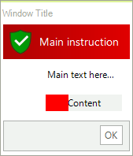
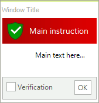
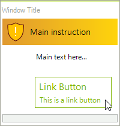
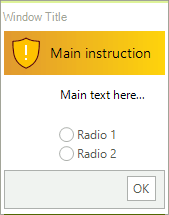
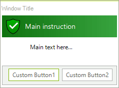

# Element Types

**RadTaskDialog** supports different element types that can be added to a **RadTaskDialogPage** which represents the main container that hosts the elements.

>note Before proceeding further with this article, it is recommended to get familiar with the internal structure of **RadTaskDialog** and how the elements are being organized: [Task Dialog's Structure]()

You can find listed below the most common elements that are usually inserted to a **RadTaskDialog**:

## RadTaskDialogPage

**RadTaskDialogPage** contains the main UI elements and defines the layout logic. Once you have built the page's content, the RadTaskDialog.**ShowDialog** method expects a page as an input parameter.

**RadTaskDialogPage** offers the following events:

* **Created** - occurs when the page is added to the dialog and is about to become visible to the user. 
* **Destroyed** - occurs when the page is about to be unbound from the task dialog.  
* **HelpRequest** - occurs when the user presses `F1` or clicks the “Help” standard button. 

## RadTaskDialogProgressBar

**RadTaskDialogProgressBar** displays progress information to the user.

The **State** property determines the mode - undetermined or determine which controls internally what element will be used - a **RadProgressBarElement** or a **RadWaitingBarElement**.

The **State** property is of type **RadTaskDialogProgressBarState** which offers the following options:

* **Normal** - shows a progress bar with bar which is green.
* **Paused** - shows a progress bar with bar which is yellow.
* **Error** - shows a progress bar with bar which is red.
* **Marquee** - shows a waiting bar in its default waiting bar style.
* **MarqueePaused** - shows a waiting bar which initially looks like an empty progress bar, but also can be paused at some point.
* **None** - neither progress bar, nor waiting bar is shown.

 

#### Adding a RadTaskDialogProgressBar

{{source=..\SamplesCS\TaskDialog\TaskDialogGettingStarted.cs region=ProgressElement}} 
{{source=..\SamplesVB\TaskDialog\TaskDialogGettingStarted.vb region=ProgressElement}}

````C#
            RadTaskDialogPage page = new RadTaskDialogPage();
            page.Caption = "Window Title";
            page.Heading = "Main instruction";
            page.Text = "Main text here...";
            page.Icon = RadTaskDialogIcon.ShieldErrorRedBar;
            page.Icon.SvgImage = RadTaskDialogIcon.GetSvgImage(RadTaskDialogIconImage.FlatShieldSuccess, new Size(32, 32));

            RadTaskDialogProgressBar taskProgressBar = new RadTaskDialogProgressBar();
            taskProgressBar.Value = 30;
            taskProgressBar.State = RadTaskDialogProgressBarState.Error;
            page.ProgressBar = taskProgressBar;
            page.ProgressBar.Text = "Content";

            RadTaskDialog.ShowDialog(page);

````
````VB.NET

        Dim page As RadTaskDialogPage = New RadTaskDialogPage()
        page.Caption = "Window Title"
        page.Heading = "Main instruction"
        page.Text = "Main text here..."
        page.Icon = RadTaskDialogIcon.ShieldErrorRedBar
        page.Icon.SvgImage = RadTaskDialogIcon.GetSvgImage(RadTaskDialogIconImage.FlatShieldSuccess, New Size(32, 32))
        Dim taskProgressBar As RadTaskDialogProgressBar = New RadTaskDialogProgressBar()
        taskProgressBar.Value = 30
        taskProgressBar.State = RadTaskDialogProgressBarState.[Error]
        page.ProgressBar = taskProgressBar
        page.ProgressBar.Text = "Content"
        RadTaskDialog.ShowDialog(page)

````

## RadTaskDialogVerificationCheckBox

**RadTaskDialogVerificationCheckBox** represents a check box shown in the collapsible command area of a **RadTaskDialog**. Appropriate for simple choices such as *"Do not show this dialog again"*.

 

#### Adding a RadTaskDialogVerificationCheckBox

{{source=..\SamplesCS\TaskDialog\TaskDialogGettingStarted.cs region=VerificationCheckBox}} 
{{source=..\SamplesVB\TaskDialog\TaskDialogGettingStarted.vb region=VerificationCheckBox}}

````C#
            RadTaskDialogPage page = new RadTaskDialogPage();
            page.Caption = "Window Title";
            page.Heading = "Main instruction";
            page.Text = "Main text here...";
            page.Icon = RadTaskDialogIcon.ShieldErrorRedBar;
            page.Icon.SvgImage = RadTaskDialogIcon.GetSvgImage(RadTaskDialogIconImage.FlatShieldSuccess, new Size(32, 32));

            RadTaskDialogVerificationCheckBox verificationCheck = new RadTaskDialogVerificationCheckBox();
            verificationCheck.Text = "Verification";
            verificationCheck.CheckStateChanged += new EventHandler(delegate(object sender, EventArgs e) { RadMessageBox.Show(verificationCheck.CheckState.ToString()); });
            page.Verification = verificationCheck;
            RadTaskDialog.ShowDialog(page);
            
````
````VB.NET

           Dim page As RadTaskDialogPage = New RadTaskDialogPage()
        page.Caption = "Window Title"
        page.Heading = "Main instruction"
        page.Text = "Main text here..."
        page.Icon = RadTaskDialogIcon.ShieldErrorRedBar
        page.Icon.SvgImage = RadTaskDialogIcon.GetSvgImage(RadTaskDialogIconImage.FlatShieldSuccess, New Size(32, 32))
        Dim verificationCheck As RadTaskDialogVerificationCheckBox = New RadTaskDialogVerificationCheckBox()
        verificationCheck.Text = "Verification"
        AddHandler verificationCheck.CheckStateChanged, New EventHandler(Function(sender As Object, e As EventArgs)
                                                                             RadMessageBox.Show(verificationCheck.CheckState.ToString())
                                                                         End Function)
        page.Verification = verificationCheck
        RadTaskDialog.ShowDialog(page)     

````

## RadTaskDialogCommandLinkButton

**RadTaskDialogCommandLinkButton** represents a flat button positioned in the content area of the page.

 

#### Adding a RadTaskDialogCommandLinkButton

{{source=..\SamplesCS\TaskDialog\TaskDialogGettingStarted.cs region=LinkButton}} 
{{source=..\SamplesVB\TaskDialog\TaskDialogGettingStarted.vb region=LinkButton}}

````C#
               RadTaskDialogPage page = new RadTaskDialogPage();
            page.Caption = "Window Title";
            page.Heading = "Main instruction";
            page.Text = "Main text here...";
            page.Icon = RadTaskDialogIcon.ShieldWarningYellowBar;
            page.Icon.SvgImage = RadTaskDialogIcon.GetSvgImage(RadTaskDialogIconImage.FlatShieldWarning, new Size(32, 32));

            RadTaskDialogCommandLinkButton linkButton = new RadTaskDialogCommandLinkButton();
            linkButton.Text = "Link Button";
            linkButton.DescriptionText = "This is a link button";
            page.ContentArea.Buttons.Add(linkButton);
            RadTaskDialog.ShowDialog(page);       
            
````
````VB.NET
        Dim page As RadTaskDialogPage = New RadTaskDialogPage()
        page.Caption = "Window Title"
        page.Heading = "Main instruction"
        page.Text = "Main text here..."
        page.Icon = RadTaskDialogIcon.ShieldWarningYellowBar
        page.Icon.SvgImage = RadTaskDialogIcon.GetSvgImage(RadTaskDialogIconImage.FlatShieldWarning, New Size(32, 32))
        Dim linkButton As RadTaskDialogCommandLinkButton = New RadTaskDialogCommandLinkButton()
        linkButton.Text = "Link Button"
        linkButton.DescriptionText = "This is a link button"
        page.ContentArea.Buttons.Add(linkButton)
        RadTaskDialog.ShowDialog(page)
       

````

## RadTaskDialogRadioButton

Adding multiple **RadTaskDialogRadioButtons** allows users to choose from different options. 

 

#### Adding a RadTaskDialogRadioButton

{{source=..\SamplesCS\TaskDialog\TaskDialogGettingStarted.cs region=RadioChoices}} 
{{source=..\SamplesVB\TaskDialog\TaskDialogGettingStarted.vb region=RadioChoices}}

````C#
            RadTaskDialogPage page = new RadTaskDialogPage();
            page.Caption = "Window Title";
            page.Heading = "Main instruction";
            page.Text = "Main text here...";
            page.Icon = RadTaskDialogIcon.ShieldWarningYellowBar;
            page.Icon.SvgImage = RadTaskDialogIcon.GetSvgImage(RadTaskDialogIconImage.FlatShieldWarning, new Size(32, 32));

            page.RadioButtons = new RadItemOwnerGenericCollection<RadTaskDialogRadioButton>()
            {
                new RadRadioButtonElement() { Text = "Radio 1" },
                new RadRadioButtonElement() { Text = "Radio 2" }
            };
            
            RadTaskDialog.ShowDialog(page);      
            
````
````VB.NET
         Dim page As RadTaskDialogPage = New RadTaskDialogPage()
        page.Caption = "Window Title"
        page.Heading = "Main instruction"
        page.Text = "Main text here..."
        page.Icon = RadTaskDialogIcon.ShieldWarningYellowBar
        page.Icon.SvgImage = RadTaskDialogIcon.GetSvgImage(RadTaskDialogIconImage.FlatShieldWarning, New Size(32, 32))
        page.RadioButtons = New RadItemOwnerGenericCollection(Of RadTaskDialogRadioButton)() From {
            New RadRadioButtonElement() With {
                .Text = "Radio 1"
            },
            New RadRadioButtonElement() With {
                .Text = "Radio 2"
            }
        }
        RadTaskDialog.ShowDialog(page)      
       

````

## RadTaskDialogButton

**RadTaskDialogButton** is shown in the command area of the page. 

 

#### Adding a RadTaskDialogButton

{{source=..\SamplesCS\TaskDialog\TaskDialogGettingStarted.cs region=DialogButtons}} 
{{source=..\SamplesVB\TaskDialog\TaskDialogGettingStarted.vb region=DialogButtons}}

````C#
            RadTaskDialogPage page = new RadTaskDialogPage();
            page.Caption = "Window Title";
            page.Heading = "Main instruction";
            page.Text = "Main text here...";
            page.Icon = RadTaskDialogIcon.ShieldSuccessGreenBar ;
            page.Icon.SvgImage = RadTaskDialogIcon.GetSvgImage(RadTaskDialogIconImage.GradientShieldSuccess , new Size(32, 32));

            RadTaskDialogButton button1 = new RadTaskDialogButton();
            button1.Text = "Custom Button1";
            button1.Click += new EventHandler(delegate(object sender, EventArgs e) { RadMessageBox.Show("Clicked Button1!"); });
            page.DefaultButton = button1;
            page.CommandAreaButtons.Add(button1);
            RadTaskDialogButton button2 = new RadTaskDialogButton();
            button2.Text = "Custom Button2";
            button2.Click += new EventHandler(delegate(object sender, EventArgs e) { RadMessageBox.Show("Clicked Button2!"); });
            page.CommandAreaButtons.Add(button2);

            RadTaskDialog.ShowDialog(page);             
            
````
````VB.NET
       
           Dim page As RadTaskDialogPage = New RadTaskDialogPage()
        page.Caption = "Window Title"
        page.Heading = "Main instruction"
        page.Text = "Main text here..."
        page.Icon = RadTaskDialogIcon.ShieldSuccessGreenBar
        page.Icon.SvgImage = RadTaskDialogIcon.GetSvgImage(RadTaskDialogIconImage.GradientShieldSuccess, New Size(32, 32))
        Dim button1 As RadTaskDialogButton = New RadTaskDialogButton()
        button1.Text = "Custom Button1"
        AddHandler button1.Click, New EventHandler(Function(sender As Object, e As EventArgs)
                                                       RadMessageBox.Show("Clicked Button1!")
                                                   End Function)
        page.DefaultButton = button1
        page.CommandAreaButtons.Add(button1)
        Dim button2 As RadTaskDialogButton = New RadTaskDialogButton()
        button2.Text = "Custom Button2"
        AddHandler button2.Click, New EventHandler(Function(sender As Object, e As EventArgs)
                                                       RadMessageBox.Show("Clicked Button2!")
                                                   End Function)
        page.CommandAreaButtons.Add(button2)
        RadTaskDialog.ShowDialog(page)    

````

# See Also

* [Structure]()
 
        
