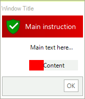
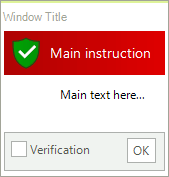
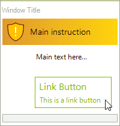
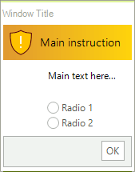
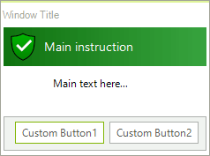

# Element Types

**RadTaskDialog** supports different element types that can be added to a **RadTaskDialogPage** which represents the main container that hosts the elements.

>note Before proceeding further with this article, it is recommended to get familiar with the internal structure of **RadTaskDialog** and how the elements are being organized: [Task Dialog's Structure]()

You can find listed below the most common elements that are usually inserted to a **RadTaskDialog**:

## RadTaskDialogPage

**RadTaskDialogPage** contains the main UI elements and defines the layout logic. Once you have built the page's content, the RadTaskDialog.**ShowDialog** method expects a page as an input parameter.

**RadTaskDialogPage** offers the following events:

* **Created** - occurs when the page is added to the dialog and is about to become visible to the user. 
* **Destroyed** - occurs when the page is about to be unbound from the task dialog.  
* **HelpRequest** - occurs when the user presses `F1` or clicks the “Help” standard button. 

## RadTaskDialogProgressBar

**RadTaskDialogProgressBar** displays progress information to the user.

The **State** property determines the mode - undetermined or determine which controls internally what element will be used - a **RadProgressBarElement** or a **RadWaitingBarElement**.

The **State** property is of type **RadTaskDialogProgressBarState** which offers the following options:

* **Normal** - shows a progress bar with bar which is green.
* **Paused** - shows a progress bar with bar which is yellow.
* **Error** - shows a progress bar with bar which is red.
* **Marquee** - shows a waiting bar in its default waiting bar style.
* **MarqueePaused** - shows a waiting bar which initially looks like an empty progress bar, but also can be paused at some point.
* **None** - neither progress bar, nor waiting bar is shown.

 

#### Adding a RadTaskDialogProgressBar

<snippet id='task-dialog-taskdialoggettingstarted-progresselement-cs' />
<snippet id='task-dialog-taskdialoggettingstarted-progresselement-vb' />

## RadTaskDialogVerificationCheckBox

**RadTaskDialogVerificationCheckBox** represents a check box shown in the collapsible command area of a **RadTaskDialog**. Appropriate for simple choices such as *"Do not show this dialog again"*.

 

#### Adding a RadTaskDialogVerificationCheckBox

<snippet id='task-dialog-taskdialoggettingstarted-verificationcheckbox-cs' />
<snippet id='task-dialog-taskdialoggettingstarted-verificationcheckbox-vb' />

## RadTaskDialogCommandLinkButton

**RadTaskDialogCommandLinkButton** represents a flat button positioned in the content area of the page.

 

#### Adding a RadTaskDialogCommandLinkButton

<snippet id='task-dialog-taskdialoggettingstarted-linkbutton-cs' />
<snippet id='task-dialog-taskdialoggettingstarted-linkbutton-vb' />

## RadTaskDialogRadioButton

Adding multiple **RadTaskDialogRadioButtons** allows users to choose from different options. 

 

#### Adding a RadTaskDialogRadioButton

<snippet id='task-dialog-taskdialoggettingstarted-radiochoices-cs' />
<snippet id='task-dialog-taskdialoggettingstarted-radiochoices-vb' />

## RadTaskDialogButton

**RadTaskDialogButton** is shown in the command area of the page. 

 

#### Adding a RadTaskDialogButton

<snippet id='task-dialog-taskdialoggettingstarted-dialogbuttons-cs' />
<snippet id='task-dialog-taskdialoggettingstarted-dialogbuttons-vb' />

# See Also

* [Structure]()
 
        
