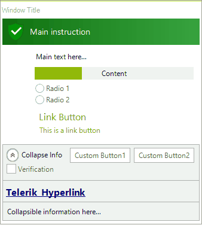

# Getting Started with WinForms TaskDialog

This tutorial will help you to quickly get started using the control.

## Adding Telerik Assemblies Using NuGet

To use `RadTaskDialog` when working with NuGet packages, install the `Telerik.UI.for.WinForms.AllControls` package. The [package target framework version may vary]().

Read more about NuGet installation in the [Install using NuGet Packages]() article.

>tip With the 2025 Q1 release, the Telerik UI for WinForms has a new licensing mechanism. You can learn more about it [here]().

## Adding Assembly References Manually

To use the control, you'll need to manually reference the following assemblies:

* __Telerik.Licensing.Runtime__
* __Telerik.WinControls__
* __Telerik.WinControls.UI__
* __TelerikCommon__

The Telerik UI for WinForms assemblies can be install by using one of the available [installation approaches](). 

## Defining the RadTaskDialog

Before proceeding further with this article, it is recommended to get familiar with the internal structure of **RadTaskDialog** and how the elements are being organized: [Task Dialog's Structure]()

This article will walk you through the creation of a sample task dialog that contains a link button, several radio buttons, a progress bar and collapsible information in the footer via code.

 

<snippet id='task-dialog-taskdialoggettingstarted-example1-cs' />
<snippet id='task-dialog-taskdialoggettingstarted-example1-vb' />

## Multiple Pages

**RadTaskDialogPage** offers the **Navigate** method which allows you to navigate from the current page to another page and thus simulate a simple wizard. 
 In the above code snippet, it is possible to subscribe to the **Click** event of the **RadTaskDialogCommandLinkButton** and call the **Navigate** method of the current page passing the next page as an input argument.

>important Please make sure that the **AllowCloseDialog** property is set to *false* for the **RadTaskDialogCommandLinkButton**. Otherwise, the task dialog is expected to be closed when the user clicks the button. 

<snippet id='task-dialog-taskdialoggettingstarted-multiplepages-cs' />
<snippet id='task-dialog-taskdialoggettingstarted-multiplepages-vb' />

## See Also

* [Structure]()
* [Element Types]()
 
        

## Telerik UI for WinForms Learning Resources
* [Telerik UI for WinForms TaskDialog Component](https://www.telerik.com/products/winforms/taskdialog.aspx)
* [Getting Started with Telerik UI for WinForms Components](https://docs.telerik.com/devtools/winforms/getting-started/first-steps)
* [Telerik UI for WinForms Setup](https://docs.telerik.com/devtools/winforms/installation-and-upgrades/installing-on-your-computer)
* [Telerik UI for WinForms Converter](https://www.telerik.com/products/winforms/documentation/ai-coding-assistant/converter/converter)
* [Telerik UI for WinForms Visual Studio Templates](https://docs.telerik.com/devtools/winforms/visual-studio-integration/visual-studio-templates)
* [Deploy Telerik UI for WinForms Applications](https://docs.telerik.com/devtools/winforms/deployment-and-distribution/application-deployment)
* [Telerik UI for WinForms Virtual Classroom(Training Courses for Registered Users)](https://learn.telerik.com/learn/course/external/view/elearning/17/telerik-ui-for-winforms)
* [Telerik UI for WinForms License Agreement)](https://www.telerik.com/purchase/license-agreement/winforms-dlw-s)

