# Dialog Icons

**RadTaskDialog** shows a large icon in the header layout that signifies the purpose of the dialog. The RadTaskDialogPage.**Icon** property allows you to specify the **RadTaskDialogIcon** itself. 

#### Specifying the dialog icon

{{source=..\SamplesCS\TaskDialog\TaskDialogGettingStarted.cs region=DialogIcon}} 
{{source=..\SamplesVB\TaskDialog\TaskDialogGettingStarted.vb region=DialogIcon}}

````C#
             RadTaskDialogPage page = new RadTaskDialogPage();
            page.Caption = "Window Title";
            page.Heading = "Main instruction";
            page.Text = "Main text here...";
            page.Icon = RadTaskDialogIcon.Information;
            RadTaskDialog.Show(page);        

````
````VB.NET

         Dim page As RadTaskDialogPage = New RadTaskDialogPage()
        page.Caption = "Window Title"
        page.Heading = "Main instruction"
        page.Text = "Main text here..."
        page.Icon = RadTaskDialogIcon.Information
        RadTaskDialog.Show(page)    

````

You can find listed below the available built-in icons:

* RadTaskDialogIcon.**None** - no icon is displayed

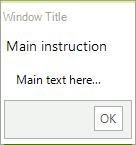 

* RadTaskDialogIcon.**Information**  

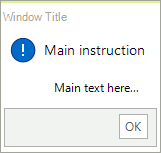 

* RadTaskDialogIcon.**Warning** 

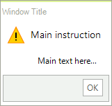

* RadTaskDialogIcon.**Error** 

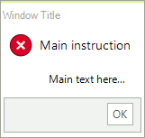

* RadTaskDialogIcon.**Shield** 

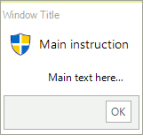

* RadTaskDialogIcon.**ShieldBlueBar** 

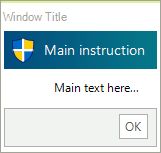

* RadTaskDialogIcon.**ShieldGrayBar** 

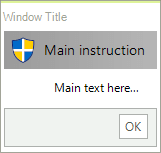

* RadTaskDialogIcon.**ShieldWarningYellowBar** 

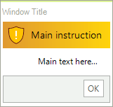

* RadTaskDialogIcon.**ShieldErrorRedBar** 

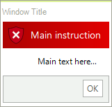

* RadTaskDialogIcon.**ShieldSuccessGreenBar** 

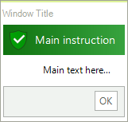

>note The RadTaskDialogPage.Icon.**SvgImage** property allows you to specify the vector image to the task dialog. The RadTaskDialogIcon.**GetSvgImage(RadTaskDialogIconImage icon, Size? size = null)** method offers an easy way of creating a **SvgImage** passing the **RadTaskDialogIconImage** and size as arguments.

## Custom Icon

If none of the built-in icons fits your needs, it is possible to construct your own **RadTaskDialogIcon**:

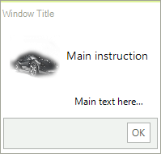

{{source=..\SamplesCS\TaskDialog\TaskDialogGettingStarted.cs region=CustomIcon}} 
{{source=..\SamplesVB\TaskDialog\TaskDialogGettingStarted.vb region=CustomIcon}}

````C#
             RadTaskDialogPage page = new RadTaskDialogPage();
            page.Caption = "Window Title";
            page.Heading = "Main instruction";
            page.Text = "Main text here...";
            page.Icon = new RadTaskDialogIcon(new Bitmap(Properties.Resources.TV_car,new Size(64,64)));
            RadTaskDialog.Show(page);      

````
````VB.NET
          Dim page As RadTaskDialogPage = New RadTaskDialogPage()
        page.Caption = "Window Title"
        page.Heading = "Main instruction"
        page.Text = "Main text here..."
        page.Icon = New RadTaskDialogIcon(New Bitmap(My.Resources.TV_car1, New Size(64, 64)))
        RadTaskDialog.Show(page)  

````

# See Also

* [Getting Started]()
* [Structure]()
* [Element Types]()
 
        
