# Dialog Icons

**RadTaskDialog** shows a large icon in the header layout that signifies the purpose of the dialog. The RadTaskDialogPage.**Icon** property allows you to specify the **RadTaskDialogIcon** itself. 

#### Specifying the dialog icon

<snippet id='task-dialog-taskdialoggettingstarted-dialogicon-cs' />
<snippet id='task-dialog-taskdialoggettingstarted-dialogicon-vb' />

You can find listed below the available built-in icons:

* RadTaskDialogIcon.**None** - no icon is displayed

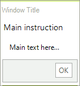 

* RadTaskDialogIcon.**Information**  

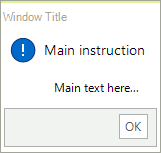 

* RadTaskDialogIcon.**Warning** 

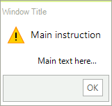

* RadTaskDialogIcon.**Error** 

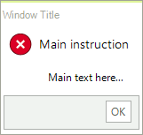

* RadTaskDialogIcon.**Shield** 

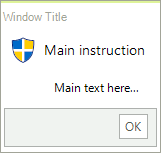

* RadTaskDialogIcon.**ShieldBlueBar** 

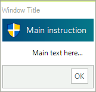

* RadTaskDialogIcon.**ShieldGrayBar** 

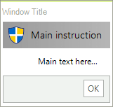

* RadTaskDialogIcon.**ShieldWarningYellowBar** 

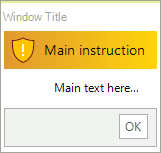

* RadTaskDialogIcon.**ShieldErrorRedBar** 

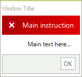

* RadTaskDialogIcon.**ShieldSuccessGreenBar** 

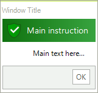

>note The RadTaskDialogPage.Icon.**SvgImage** property allows you to specify the vector image to the task dialog. The RadTaskDialogIcon.**GetSvgImage(RadTaskDialogIconImage icon, Size? size = null)** method offers an easy way of creating a **SvgImage** passing the **RadTaskDialogIconImage** and size as arguments.

## Custom Icon

If none of the built-in icons fits your needs, it is possible to construct your own **RadTaskDialogIcon**:

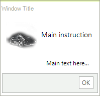

<snippet id='task-dialog-taskdialoggettingstarted-customicon-cs' />
<snippet id='task-dialog-taskdialoggettingstarted-customicon-vb' />

# See Also

* [Getting Started]()
* [Structure]()
* [Element Types]()
 
        
