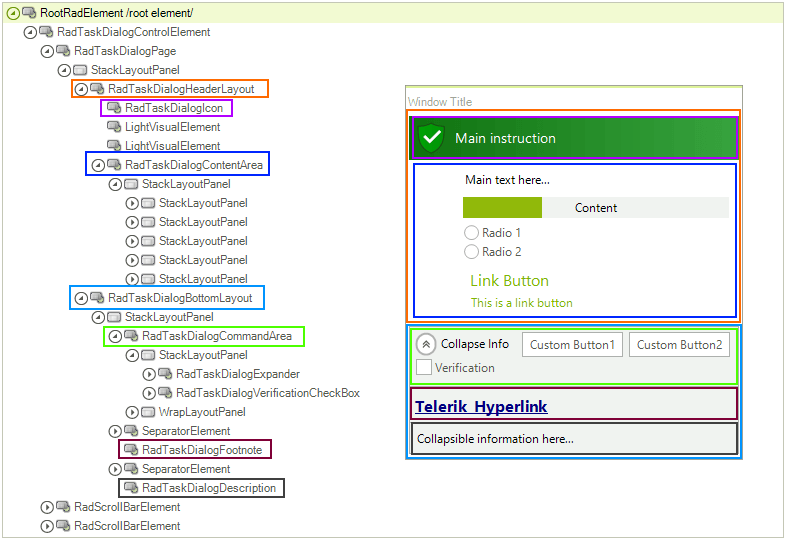

# Structure

**RadTaskDialog** is the component used by the developers. It contains a **RadTaskDialogForm** and shows it using a predefined API. It also exposes the most used properties, methods and events of the **RadTaskDialogForm**. **RadTaskDialogForm** has a single control on it called **RadTaskDialogControl**, which is docked and occupies the whole space. The **RadTaskDialogControl** contains one main element, **RadTaksDialogControlElement**. This
**RadTaskDialogControlElement** consists of one single child – a page that simulates paging (something like a very simple [RadWizard]() control). The **RadTaskDialogPage** contains the main UI elements and defines the layout logic. 

The picture below illustrates the inner structure and organization of the elements which build the **RadTaskDialog** control.

 

# See Also

* [Getting Started]()
* [Overview]()
* [Element Types]()
 
        
