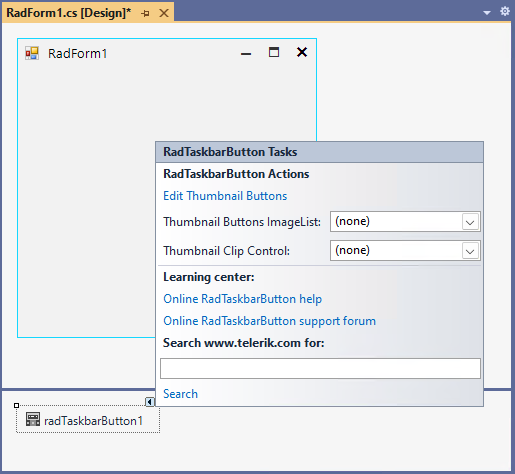
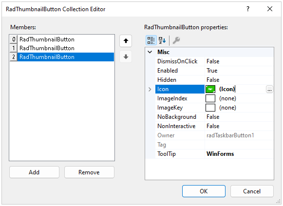
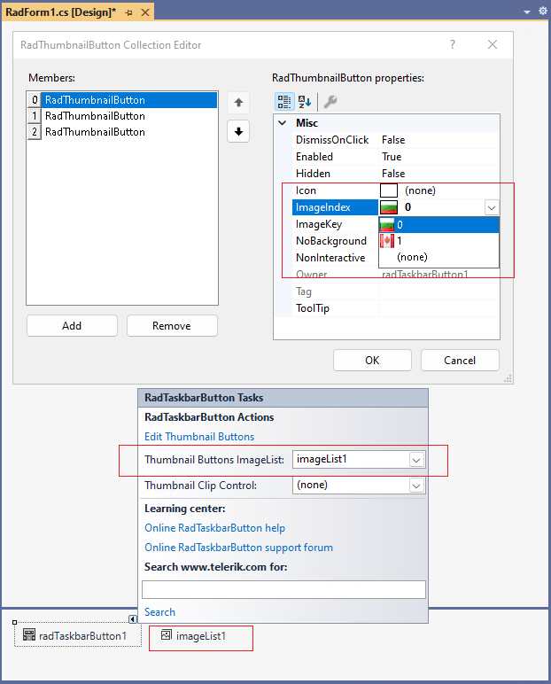

# Design Time  

To start using **RadTaskbarButton** just drag it from the toolbox and drop it on the form.
 
## Smart Tag

Select RadTaskbarButton and click the small arrow on the top right position in order to open the Smart Tag.

- **Edit Thumbnail Buttons** - Opens the *RadThumbnailButton Collection Editor* which allows you to add [Thumbnail Buttons]()

- **Thumbnail Buttons ImageList** - Associates an ImageList which is used for the [Thumbnail Buttons]() in the *RadThumbnailButton Collection Editor*

 

- **Thumbnail Clip Control** - Specifies the control which will be used in the preview pop-up. By default there is a snapshot of the whole application window.  

# See Also

* [Getting Started]()
 
        
