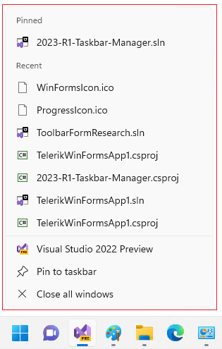
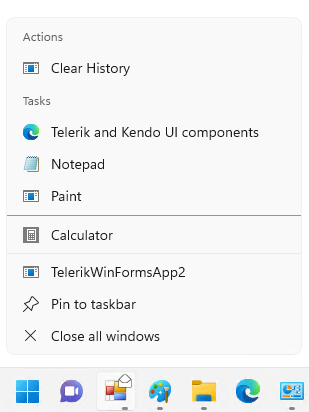

# Jump List

A jump list is a system-provided menu that appears when the user right-clicks a program in the taskbar. It is used to provide quick access to *recently* or *frequently* used documents and offers direct links to app functionality.

>caption Jump List for Visual Studio 2022 Preview



The following code snippet demonstrates how to define a jump list for the Windows Forms application we have:

{{source=..\SamplesCS\RadTaskbarButton\RadTaskbarButton.cs region=JumpList}} 
{{source=..\SamplesVB\RadTaskbarButton\RadTaskbarButton.vb region=JumpList}}

````C#

            RadJumpList list = new RadJumpList("Mail Application", this.Handle);  

            JumpLink task = new JumpLink("https://www.telerik.com/", "Telerik and Kendo UI components");
            task.ShowCommand = WindowShowCommand.Show; 
            task.IconReference = new IconReference(@"R:\UX\Progress Rebranding\Product Icons\WinForms.ico", 0);
            list.Tasks.Add(task);

            // Custom categories
            JumpListCategory userActionsCategory = new JumpListCategory("Actions");

            JumpLink userActionLink = new JumpLink(Assembly.GetEntryAssembly().Location, "Clear History");
            userActionLink.Arguments = "-1";

            //JumpItem ji = new JumpItem(@"R:\UX\Progress Rebranding\Product Icons\WinForms.ico");
            //userActionsCategory.AddJumpItem(ji);


            userActionsCategory.JumpItems.Add(userActionLink);
            list.Categories.Add(userActionsCategory);

            string notepadPath = Path.Combine(Environment.SystemDirectory, "notepad.exe");
            JumpLink jlNotepad = new JumpLink(notepadPath, "Notepad");

            //jlNotepad.IconReference = new IconReference(notepadPath, 0);
            jlNotepad.IconReference = new IconReference(@"C:\Program Files (x86)\Google\Chrome\Application\chrome.exe", 0);

            string calcPath = Path.Combine(Environment.SystemDirectory, "calc.exe");
            JumpLink jlCalculator = new JumpLink(calcPath, "Calculator");
            jlCalculator.IconReference = new IconReference(calcPath, 0);

            string mspaintPath = Path.Combine(Environment.SystemDirectory, "mspaint.exe");
            JumpLink jlPaint = new JumpLink(mspaintPath, "Paint");
            jlPaint.IconReference = new IconReference(mspaintPath, 0);
             
            list.Tasks.Add(jlNotepad);
            list.Tasks.Add(jlPaint);
            list.Tasks.Add(new JumpSeparator());
            list.Tasks.Add(jlCalculator);

            // To update the JumpList and the taskbar we need to call Refresh method.
            list.Refresh();

````
````VB.NET


````

{{endregion}}


 
## See Also

* [Getting Started]()
* [Design Time]() 
 
        
