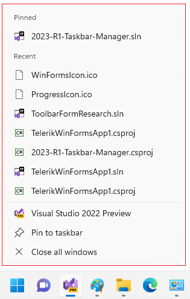
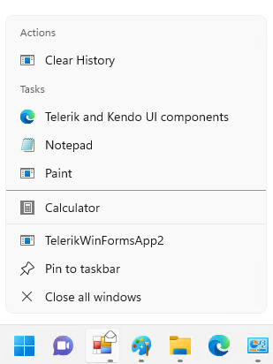

# Jump List

A jump list is a system-provided menu that appears when the user right-clicks a program in the taskbar. It is used to provide quick access to *recently* or *frequently* used documents and offers direct links to app's functionality.

>caption Jump List for Visual Studio 2022 Preview

The following code snippet demonstrates how to define a jump list for a Form inside the Windows Forms application we have:

<snippet id='taskbar-button-taskbarbuttongettingstarted-jumplist-cs' />
<snippet id='taskbar-button-taskbarbuttongettingstarted-jumplist-vb' />

>note The Jump List section in the [Keep Your Users Notified with the Brand-New WinForms TaskbarButton blog](https://www.telerik.com/blogs/keep-users-notified-brand-new-winforms-taskbarbutton) is useful for getting better understanding of the jump lists.
 
## See Also

* [Getting Started]()
* [Design Time]() 
 
        
