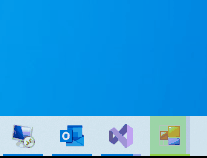

# Progress OR Progress Indication

The RadTaskbarButton component provides you with the possibility to display the progress of a task in the taskbar. To set the progress you need to use the __ProgressPercentage__ property. Its value should be between 0 and 100. You can control the progress by increasing this property.

In the following example, we are going to simulate the progress of a running task in the taskbar. On each second, the __ProgressPercentage__ property is increased by 10 percent.

{{source=..\SamplesCS\TaskbarButton\TaskbarButtonGettingStarted.cs region=Progress_Indication}} 
{{source=..\SamplesVB\TaskbarButton\TaskbarButtonGettingStarted.vb region=Progress_Indication}}

````C#

Timer timer = new Timer();
void ShowTaskProgress()
{
    timer.Interval = 1000;
    timer.Tick += Timer_Tick;
	timer.Start();
}

private void Timer_Tick(object sender, System.EventArgs e)
{
    this.radTaskbarButton1.ProgressPercentage += 10;
}

````
````VB.NET
Private timer As Timer = New Timer()

Private Sub ShowTaskProgress()
	timer.Interval = 1000
	timer.Tick += AddressOf Timer_Tick
	timer.Start()
End Sub

Private Sub Timer_Tick(ByVal sender As Object, ByVal e As System.EventArgs)
	Me.radTaskbarButton1.ProgressPercentage += 10
End Sub


````

{{endregion}}



### ProgressState

The progress visualization of the taskbar can be also controlled by the ProgressState property. This way you can add more information to the end user regarding the currently running task progress state. The __ProgressState__ property is an enumeration and it exposes the following values.

#### NoProgress

In this state, no progress visualization will appear.


#### Error 

In this state, the progress color will be set to red to indicate that an error appears while the task was running.


#### Indeterminate

In this state the progress bar won't respect the __ProgressPercentage__ property value, it will continue to load until you set a different state.


#### Normal

In this state, the progress will appear in its default visualization.


#### Pause
In this state, the color of the progress will turn into yellow. In this state, the __ProgressPercentage__ property value change should be stopped to show that the currently running task is on pause.


## See Also

* [Structure]() 
* [Getting Started]()
* [Design Time]() 
 
        
