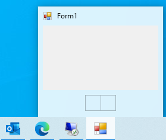

# Thumbnail Buttons

The RadTaskbarButton control can display buttons in its thumbnail part. Adding buttons to your thumbnail preview will be an excellent enhancement to your application. This way the user can call commands in your application without restoring or activating the application's window. To add thumbnail button, you can populate the __ThumbnailButtons__ collection of the control.

{{source=..\SamplesCS\TaskbarButton\TaskbarButtonGettingStarted.cs region=ThumbnailButtons}} 
{{source=..\SamplesVB\TaskbarButton\TaskbarButtonGettingStarted.vb region=ThumbnailButtons}}

````C#

Telerik.WinControls.Taskbar.RadThumbnailButton radThumbnailButton1 = new Telerik.WinControls.Taskbar.RadThumbnailButton();
Telerik.WinControls.Taskbar.RadThumbnailButton radThumbnailButton2 = new Telerik.WinControls.Taskbar.RadThumbnailButton();
this.radTaskbarButton1.ThumbnailButtons.Add(radThumbnailButton1);
this.radTaskbarButton1.ThumbnailButtons.Add(radThumbnailButton2);


````
````VB.NET

Dim radThumbnailButton1 As Telerik.WinControls.Taskbar.RadThumbnailButton = New Telerik.WinControls.Taskbar.RadThumbnailButton()
Dim radThumbnailButton2 As Telerik.WinControls.Taskbar.RadThumbnailButton = New Telerik.WinControls.Taskbar.RadThumbnailButton()
Me.RadTaskbarButton1.ThumbnailButtons.Add(radThumbnailButton1)
Me.RadTaskbarButton1.ThumbnailButtons.Add(radThumbnailButton2

````

{{endregion}}

__Figure 1__ demonstrate the above code snippet. You can observe that the buttons appears in the thumbnail preview but their content is empty.

>caption Figure 1: Thumbnail Buttons


 
To add image content to the buttons, you can populate the __ThumbnailButtonsImageList__ collection of the __RadTaskbarButton__ with the required images. Then you can set the ImageIndex property of each button to the index of image inside the collection.
 
{{source=..\SamplesCS\TaskbarButton\TaskbarButtonGettingStarted.cs region=Thumbnail_Image}} 
{{source=..\SamplesVB\TaskbarButton\TaskbarButtonGettingStarted.vb region=Thumbnail_Image}}

````C#

var images = new ImageList();
images.Images.Add(new Bitmap("../../ProgressIcon.ico"));
images.Images.Add(new Bitmap("../../WinFormsIcon.ico"));
this.radTaskbarButton1.ThumbnailButtonsImageList = images;
this.radTaskbarButton1.ThumbnailButtons[0].ImageIndex = 0;
this.radTaskbarButton1.ThumbnailButtons[1].ImageIndex = 1;


````
````VB.NET

Dim images = New ImageList()
images.Images.Add(New Bitmap("../../ProgressIcon.ico"))
images.Images.Add(New Bitmap("../../WinFormsIcon.ico"))
Me.RadTaskbarButton1.ThumbnailButtonsImageList = images
Me.RadTaskbarButton1.ThumbnailButtons(0).ImageIndex = 0
Me.RadTaskbarButton1.ThumbnailButtons(1).ImageIndex = 1

````

{{endregion}}


>caption Figure 2: Add Image


## Click Event

To distingues which button is click by the user and execute application logic, you can subscribe to the ThumbnailButtonClick event of the RadTaskbarButton. In the event handler you can get the pressed button from the event arguments.

## Non Interactive State

There could be requirement to add non interactive icon in the buttons section inside the thumbnail preview. To simulate this effect you can use the NonBackground and NonInteractive properties. The first one will remove the border rectangle and mouse hover effects and the second one will disable the button press event. 

{{source=..\SamplesCS\TaskbarButton\TaskbarButtonGettingStarted.cs region=Non_Interactive_State}} 
{{source=..\SamplesVB\TaskbarButton\TaskbarButtonGettingStarted.vb region=Non_Interactive_State}}

````C#

this.radTaskbarButton1.ThumbnailButtons[0].NoBackground = true;
this.radTaskbarButton1.ThumbnailButtons[0].NonInteractive = true;


````
````VB.NET

Me.RadTaskbarButton1.ThumbnailButtons(0).NoBackground = True
Me.RadTaskbarButton1.ThumbnailButtons(0).NonInteractive = True

````

{{endregion}}

>caption Figure 3: NonInteractive Button


# See Also

* [Getting Started]()
* [Design Time]() 
 
        
