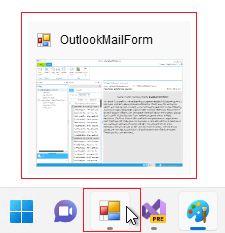
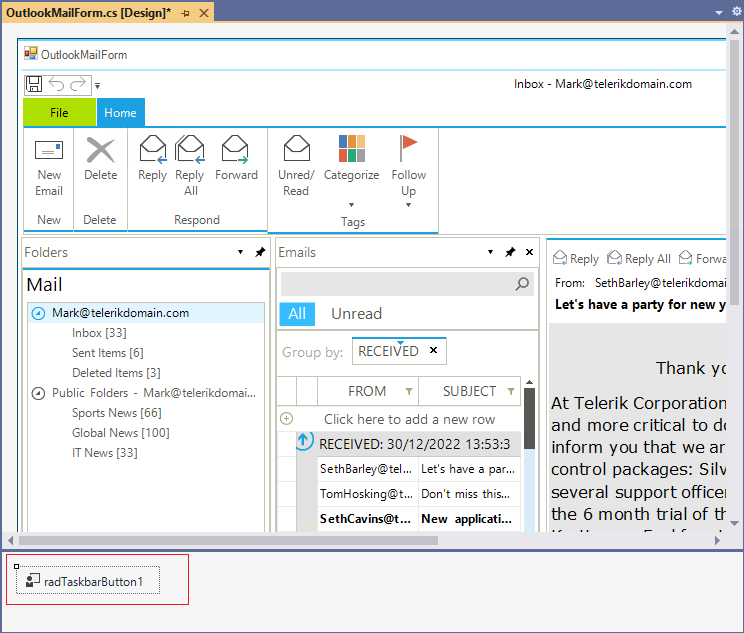
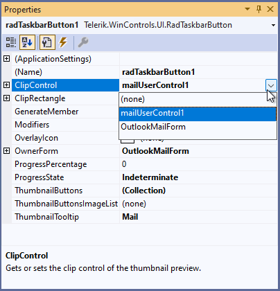
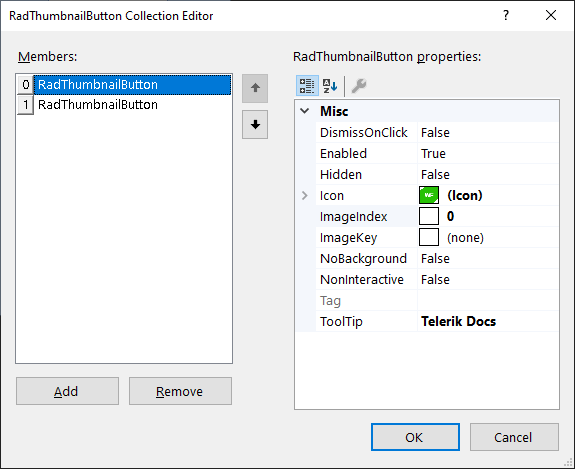
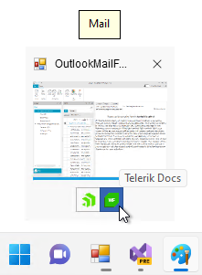
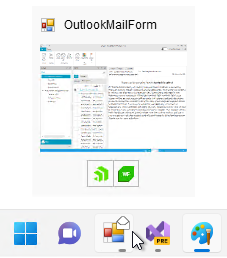

# Getting Started with WinForms Taskbar   

Before proceeding further with this article, it is recommended to get familiar with the Windows Taskbar's structure and how the different parts are being organized: [Structure]().

Let's consider that you already have an existing Windows Forms application. Otherwise, create a new project using one of the [Visual Studio Templates](). By default, when the application is running, the following button is shown in the Taskbar:

This article demonstrates how to customize this visual representation.

1\. Drag the **RadTaskbarButton** component from the Visual Studio Toolbox and drop it onto the form:

 

2\. Select the **RadTaskbarButton** component and in the Visual Studio Properties section select which control on the form (or the form itself) will be the **ClipControl**, specify the **ProgressState** and set the **ThumbnailTooltip**.

 

3\. Clicking the **ThumbnailButtons** opens the *RadThumbnailButton Collection Editor* from where you can add two RadThumbnailButtons:

 

4\. Save the changes and run the application:

 

5\. Setting the **OverlayIcon** in the Visual Studio Properties allows you to put an icon to the taskbar button:

 

>note RadTaskbarButton does not provide any UI element. It just offers convenient API for specifying the content displayed for your application on the [Windows Taskbar](https://learn.microsoft.com/en-us/windows/win32/uxguide/winenv-taskbar). The exact visualization depends on the Windows version. 

# See Also

* [Getting Started]()
* [Design Time]() 
* [Structure]() 
 
        

## Telerik UI for WinForms Learning Resources
* [Telerik UI for WinForms TaskbarButton Component](https://www.telerik.com/products/winforms/taskbarbutton.aspx)
* [Getting Started with Telerik UI for WinForms Components](https://docs.telerik.com/devtools/winforms/getting-started/first-steps)
* [Telerik UI for WinForms Setup](https://docs.telerik.com/devtools/winforms/installation-and-upgrades/installing-on-your-computer)
* [Telerik UI for WinForms Application Modernization](https://docs.telerik.com/devtools/winforms/winforms-converter/overview)
* [Telerik UI for WinForms Visual Studio Templates](https://docs.telerik.com/devtools/winforms/visual-studio-integration/visual-studio-templates)
* [Deploy Telerik UI for WinForms Applications](https://docs.telerik.com/devtools/winforms/deployment-and-distribution/application-deployment)
* [Telerik UI for WinForms Virtual Classroom(Training Courses for Registered Users)](https://learn.telerik.com/learn/course/external/view/elearning/17/telerik-ui-for-winforms)
* [Telerik UI for WinForms License Agreement)](https://www.telerik.com/purchase/license-agreement/winforms-dlw-s)

