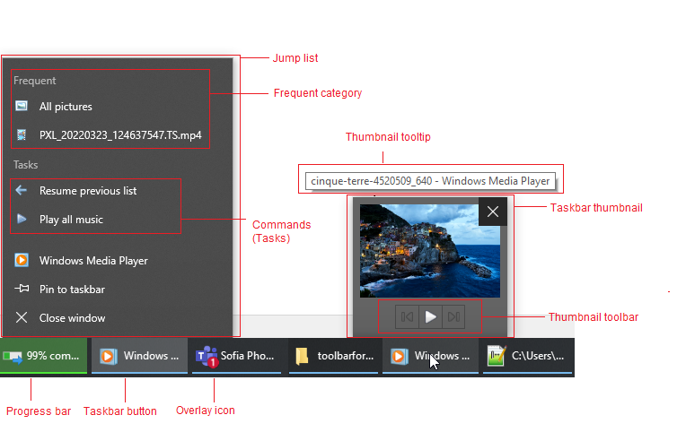

# Structure

The Taskbar is the access point for programs displayed on the desktop. With Windows 7 the taskbar features, users can give commands, access resources, and view program status directly from the taskbar. 
 

 

 
 

# See Also

* [Getting Started]()
* [Design Time]() 
 
        
