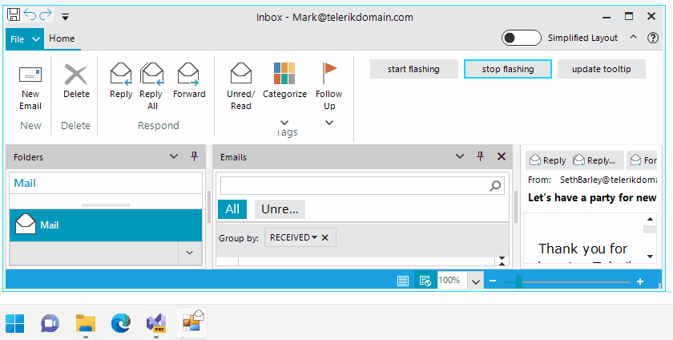

# Taskbar Manager  

**RadTaskbarManager** allows you to manage the functionality offered by our RadTaskbarButton at run time, e.g. start/stop flashing or updating the tool tip for the thumbnail. It offers convenient public static API for that purpose. Additional information is available in the [Properties, Methods and Events]() article. 

{{source=..\SamplesCS\TaskbarButton\TaskbarButtonGettingStarted.cs region=Manager}} 
{{source=..\SamplesVB\TaskbarButton\TaskbarButtonGettingStarted.vb region=Manager}}

````C#

private void radButton1_Click(object sender, EventArgs e)
{
    RadTaskbarManager.Flash(this.Handle);
}

private void radButton2_Click(object sender, EventArgs e)
{
    RadTaskbarManager.StopFlash(this.Handle);
}

private void radButton3_Click(object sender, EventArgs e)
{
    RadTaskbarManager.SetThumbnailTooltip(this.Handle, DateTime.Now.ToLongTimeString());
}

````
````VB.NET

Private Sub radButton1_Click(ByVal sender As Object, ByVal e As EventArgs)
    RadTaskbarManager.Flash(Me.Handle)
End Sub

Private Sub radButton2_Click(ByVal sender As Object, ByVal e As EventArgs)
    RadTaskbarManager.StopFlash(Me.Handle)
End Sub

Private Sub radButton3_Click(ByVal sender As Object, ByVal e As EventArgs)
    RadTaskbarManager.SetThumbnailTooltip(Me.Handle, DateTime.Now.ToLongTimeString())
End Sub

````

{{endregion}}


 

# See Also

* [Getting Started]()
* [Design Time]() 
* [Structure]() 
 
        
