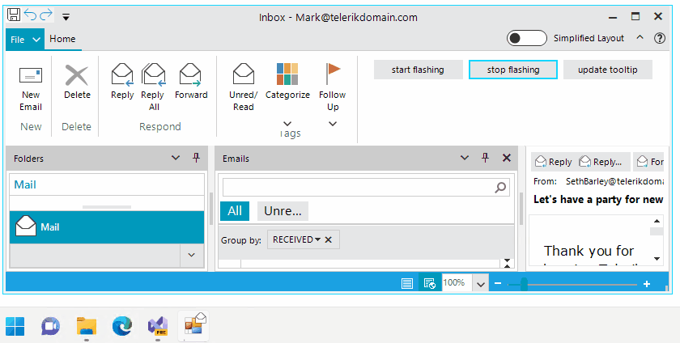

# Taskbar Manager  

**RadTaskbarManager** allows you to manage the functionality offered by our RadTaskbarButton at run time, e.g. start/stop flashing or updating the tool tip for the thumbnail. It offers convenient public static API for that purpose. Additional information is available in the [Properties, Methods and Events]() article. 

<snippet id='taskbar-button-taskbarbuttongettingstarted-manager-cs' />
<snippet id='taskbar-button-taskbarbuttongettingstarted-manager-vb' />

 

# See Also

* [Getting Started]()
* [Design Time]() 
* [Structure]() 
 
        
