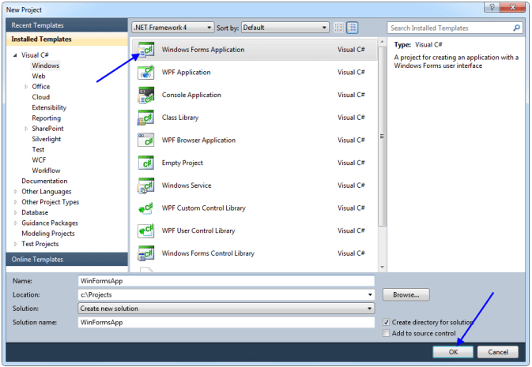
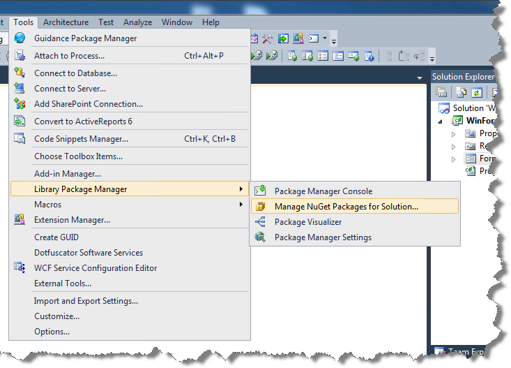
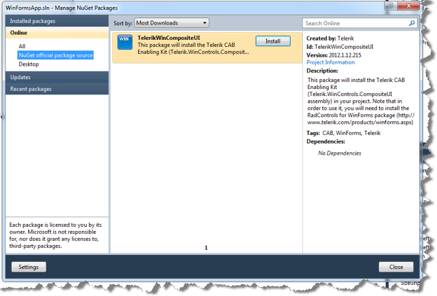
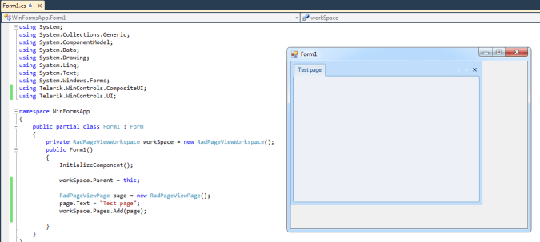

# Getting Started

Telerik CAB Enabling Kit gives you several Composite UI Application Block (CAB) Extensions for building smart client application with CAB and Telerik UI for WinForms. It allows developers take the full advantage of the flexibility that the modular structure of CAB architectural framework provides. Using Telerik CAB Enabling Kit for creating separate UI modules for Windows applications speeds up the development improves testability and reduces costs.

## Start using Telerik CAB Enabling Kit (via NuGet package)

Here is how to start building CAB application in just a few steps, by using the TelerikCompositeUI NuGet package:
        

1. Install the [Telerik UI for WinForms suite ](http://www.telerik.com/products/winforms.aspx) on your computer.
            

1. Open Visual Studio 2010 and create a new WinForms application.
	
	

1. Make sure that you have NuGet Package Manager extension for VS2010 installed.
   
1. In VS2010 navigate to *Tools > Library Package Manager > Manage NuGet Packages for Solution…*
	
	

1. Search for __TelerikWinCompositeUI__ package and click install.

    

1. Select the project(s) where you want to install this package and click OK.
 
1. The Telerik.WinControls.CompositeUI assembly will be copied to the selected project(s) directory and will be referenced in the project(s).

1. Add references to the used in the CAB kit assemblies:
	* Telerik.WinControls
	* Telerik.WinControls.RadDock
	* Telerik.WinControls.UI
	* TelerikCommon

9\. Now you can start using Telerik CAB Enabling Kit.

