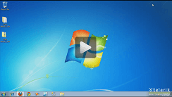
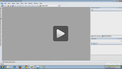
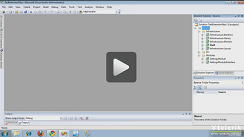
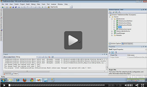
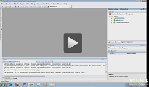
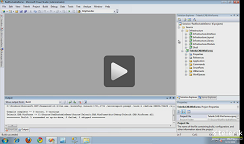

# Telerik CAB Enabling Kit

The [Telerik CAB Enabling Kit for WinForms](http://telerikcab.codeplex.com/) is part of the [Telerik UI for WinForms suite](http://www.telerik.com/products/winforms.aspx) since the R1 2008 release.  It provides seamless integration of Telerik UI for WinForms with the Composite UI Application Block (CAB). It is well suited for enterprise applications, and helps developers with using the best practices and patterns.
  
The Telerik CAB Enabling Kit (TCEK) for WinForms can be used to develop smart-client line-of-business applications such as OLTP (online transaction processing) front ends for data entry applications; rich client portals to back-end services like government or bank teller applications; UI-intensive stand-alone applications such as those used by call center staff, IT support desks or stock traders.
      



   

## The Telerik CAB Enabling Kit for WinForms advantages

* Enterprise-grade components - Telerik UI for WinForms is a complete suite allowing development of enterprise-class smart client applications and featuring more than 50 components like grid view, tree view, calendar, chart, scheduler, etc.
            

* Rich Visual Styling - Telerik UI for WinForms provide WPF-like visual appearance, XML based themes, animations and effects. The most advanced visual styling on the market.
            

* Seamless integration - Easily develop smart client applications with a  top package like Telerik UI for WinForms, the Composite UI Application Block framework and Visual Studio 2010.
            

## With the Telerik CAB Enabling Kit you can

* Easily develop smart client applications with renowned packages like Telerik UI for WinForms, the Composite UI Application Block framework, and Visual Studio 2010;
            

* Add enterprise-grade components with rich visual styling to your existing CAB applications by using Telerik UI for WinForms;
            

* Build complex, enterprise-ready Windows Forms solutions, based on common patterns and practices found in line-of-business front-end applications.
            

## Composite UI Application Block Framework

The Composite UI Application Block (CAB) framework is intended for large WinForms-based applications. The three major goals of CAB design are:
        

* __Modularity__ - you can implement business logic, visual __SmartParts__,  infrastructure components, presenter or controller components, and any other objects the application requires, in separate modules.
            

* __Productivity__ - Developer productivity increases  because each developer (or team) is able to concentrate on a specific task. The use of consistent user interfaces increases end-user productivity in applications built using Composite UI Application Block, reducing the end-user training requirements when releasing a new application.
            

* __Extensibility__ - the design of the Composite UI Application Block promotes extensibility in many different ways
            
| RELATED VIDEOS |  |
| ------ | ------ |
|[Intro to Telerik CAB Enabling Kit](http://tv.telerik.com/watch/winforms/cab/intro-telerik-cab-enabling-kit)  In this video, you'll learn what the Composite Application Block (CAB) is and how the Telerik CAB Enabling Kit can be used to integrate the RadControls for WinForms with the CAB framework.||
|[Understanding CAB, SCSF, and the Telerik CAB Enabling Kit](http://tv.telerik.com/watch/winforms/webinar/understanding-cab-scsf-telerik-cab-enabling-kit) The Composite UI Application Block (CAB) and Smart Client Software Factory (SCSF) are powerful frameworks from Microsoft that are essential for building real world, loosely-coupled WinForms applications. Unfortunately, they can be difficult to understand and configure. In this webinar, Telerik Developer Support Specialist Robert Shoemate will help introduce you to these frameworks in Visual Studio and demonstrate how the Telerik CAB Enabling Kit (TCEK) makes it easy to leverage the RadControls for WinForms instead of the out-of-the-box WinForms UI||
|[The Telerik CAB Enabling Kit - RadTreeView UIExtensionSite](http://tv.telerik.com/watch/winforms/cab/the-telerik-cab-enabling-kit-radtreeview-uiextensionsite) In this video, you will learn how to use the RadTreeView UIExtensionSite provided with the TCEK.||
|[The Telerik CAB Enabling Kit - RadPanelBar UIExtensionSite](http://tv.telerik.com/watch/winforms/cab/the-telerik-cab-enabling-kit-radpanelbar-uiextensionsite) In this video you will learn how to use the RadPanelBar UIExtensionSite provided with the TCEK.||
|[TCEK RadMenu and RadToolStrip UIExtension Sites](http://tv.telerik.com/watch/winforms/cab/tcek-radmenu-radtoolstrip-uiextension-sites) In this video, you will learn how to use the RadMenu and RadToolStrip UIExtension sites provided with the Telerik CAB Enabling Kit.||
|[The Telerik CAB Enabling Kit - RadTabWorkspace](http://tv.telerik.com/watch/winforms/cab/the-telerik-cab-enabling-kit-radtabworkspace) In this video, you will learn how to use the RadTabWorkspace provided with the Telerik CAB Enabling Kit.||
|[The Telerik CAB Enabling Kit - RadDockableWorkspace](http://tv.telerik.com/watch/winforms/cab/the-telerik-cab-enabling-kit-raddockableworkspace) In this video, you will learn how to integrate the Telerik CAB Enabling kit with an SCSF generated smart client application.You will also learn how to use the RadDockableWorkspace.||
