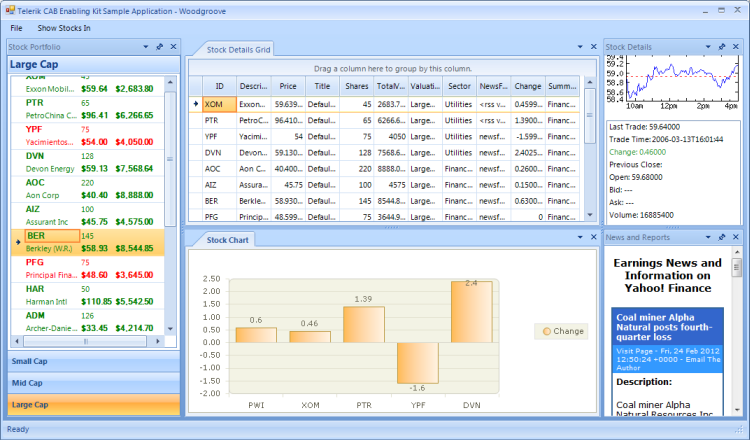

# What is in the package

The CAB kit contains all needed wrappers to start using Telerik UI for WinForms with the CAB framework right away. It also comes with documentation and a reference application to decrease the learning curve and to help you quickly get you up to speed.
      

## Supported Telerik WinForms components:

* [RadTreeView](http://www.telerik.com/products/winforms/treeview.aspx)

* [RadDock](http://www.telerik.com/products/winforms/dock.aspx)

* [RadMenu](http://www.telerik.com/products/winforms/menus.aspx#radmenu)

* [RadPageView](http://www.telerik.com/products/winforms/pageview.aspx)

* [RadCommandBar](http://www.telerik.com/products/winforms/commandbar.aspx)

* [RadRibbonBar](http://www.telerik.com/products/winforms/ribbonbar.aspx)

* [RadForm](http://www.telerik.com/products/winforms/forms-and-dialogs.aspx#form-for-windows-forms)

## Workspaces

* RadDockWorkspace

* RadFormMdiWorkspace

* RadPageViewWorkspace

* RadTabbedMdiWorkspace

## UIElementAdapters

* RadCommandBarUIAdapter

* RadItemCollectionUIAdapter

* RadMenuItemsCollectionUIAdapter

* RadMenuUIAdapter

* RadRibbonBarUIAdapter

* RadTreeNodeUIAdapter

* RadTreeViewUIAdapter

## CommandAdapters

* RadMenuItemCommandAdapter

* RadTreeNodeCommandAdapter

* RadElementCommandAdapter

## CAB Application Classes

* RadWindowsFormsApplication

* RadFormShellApplication

* RadApplicationContextApplication

## Sample application with Telerik UI for WinForms and CAB

The Telerik CAB Enabling Kit for WinForms comes with a sample app modeled after the famous WPF WoodGrove Finance Application. It uses the CAB framework and Telerik controls.

