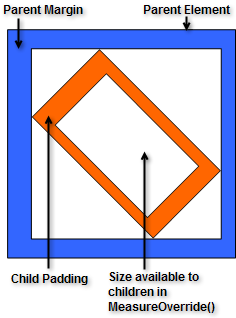
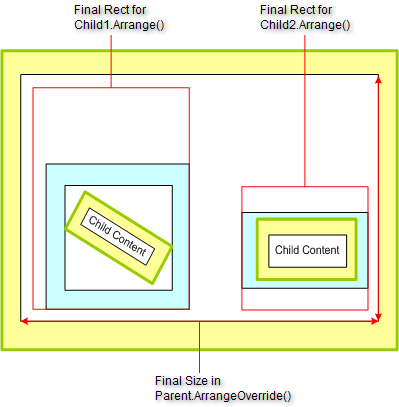

# Layout Logic

Layout of elements proceed in two stages: the measure stage that reserves size to accommodate element contents and the arrange stage that arranges elements in the container. The order of execution is the following:

* All children are measured, recursively through the hierarchy, calling their implementations of __Measure__, __MeasureCore__, __MeasureOverride__.

* All children are arranged in the __Arrange__,  __ArrangeCore__, and __ArrangeOverride__ methods.

* In case the size returned by the __ArrangeOverride__ method differs from the size it was invoked with, the Measure stage is invoked again, due to the change in the size required for layout. The measure stage is followed by a second call to Arrange, which arranges the children taking into account the new measures of the children.

## Measure Stage

The measure stage calculates the RadElement __DesiredSize__ property. __DesiredSize__ is the minimum size that ensures that element content will not be clipped.

>note  __DesiredSize__ 
* By default [FillPrimitive]() can be drawn without clipping even with empty size. DesiredSize for FillPrimitive is (0, 0) by default.
* The DesiredSize for a [HostItem](http://docs.telerik.com/devtools/winforms/api/html/t_telerik_wincontrols_radhostitem.htm) (and indirectly for RadTextBoxElement) is determined by the size of the hosted control. By default the DesiredSize of a RadTextBoxElement is determined by the default size of the hosted TextBox.
* The DesiredSize of RadLabel is determined by the Font and the Text property.
>

The measure stage recurses over the element hierarchy calling three functions: __Measure__, __MeasureCore__ and __MeasureOverride__. An element's __Measure__ method calls __MeasureCore__, which in turn calls __MeasureOverride__. __MeasureOverride__ calls the __Measure__ method of all element children.

## Measure

The __Measure__ function manages the progression of states in the layout mechanism, e.g. adding and removing the element from the "measure queue".

## MeasureCore

__MeasureCore__ ensures transparency for logic that calculates the desired size in __MeasureOverride__. MeasureCore tasks are:

* Transform the size parameter passed to __MeasureOverride__ so that __Margins__, __Scale__ and __AngleTransform__ are taken into account. The meaning of this parameter is "the size provided by the parent in which the desired size must fit". 

* Transform the __MeasureOverride__ return value, again taking __Margins__, __Scale__ and __AngleTransform__ into account. To the __DesiredSize__ is assigned the result of this transformation. 

Padding is handled differently for each custom layout and so is not considered in the base __MeasureCore__ method. Padding should be handled in the __MeasureOverride__ method.

## MeasureOverride

This method receives a parameter containing the size available for its children after transformations are applied (margin, rotation, scaling).  __MeasureOverride__ returns the minimum size of the area in which all child elements can be positioned according to their __DesiredSizes__ and any other logic implemented. The default implementation returns the maximum dimension values of the child elements.

__MeasureOverride__ should call the __Measure__ method for any children. The __Measure__ method takes a single SizeF "availableSize" parameter. To the DesiredSize is assigned the availableSize or the MeasureOverride return value, whichever is less. The diagram below shows how the size available to children is determined after applying margin, padding and rotation transformations to the size available for the parent element.

## Arrange Stage

After the measuring stage of the layout process completes, the arrange stage is invoked to position child elements within the allocated area. The arrange stage calculates the size available to children, taking into account margins, transformations, alignment and stretching. The process is analogous to the measure stage. The methods are __Arrange__, __ArrangeCore__ and __ArrangeOverride__.

## ArrangeOverride

This method receives a parameter containing the available size for children to be arranged in. Child elements must have their __Arrange__  method called to have their bounds set. The rectangle that is fed to each child __Arrange__ call is the area where the child can position itself. The child can be stretched within the available area or aligned within the area using the __Alignment__ property.

The __DesiredSize__ of every child is valid in the parent's ArrangeOverride() method and may be used in the calculations.
        

The rectangles allocated by __ArrangeOverride__ do not need to be next to each other or ordered in any particular fashion. The example below shows a  scenario where children are arranged with a size greater then their desired size. The first child is aligned in the bottom-right corner of the size it has received for layout, while the second child is stretched horizontally and aligned in the center.

>caution The __ArrangeOverride__ and __MeasureOverride__ implementations in the layout panel logic are to be used for reserving size and arranging elements within the available area. They are not meant to be used for setting layout properties, but rather for implementing the logic needed to achieve the desired visual appearance.
Layout-affecting properties such as [Margin, Scale and Padding]() are meant to be set outside of the layout panel logic code.
>

## Implementation Details

There are two static queues for the two layout stages: __MeasureQueue__ and __ArrangeQueue__. The layout consists of two cycles that loop through the elements in the queues. The first cycle is the measure cycle which loops over the measure queue and exits when the measure queue is empty. The second cycle loops over the arrange queue and exits when the arrange queue is empty. During these two cycles, elements can be added to the two queues. There is a cycle that encloses the two aforementioned cycles, which runs until the two queues are empty.

The measure cycle calls its Measure method for each element in the measure queue. The Measure method deletes the element from the queue if the Measure stage is finished for the element. The arrange cycle calls the Arrange method of each element in the arrange queue in a similar way. Each time the measure or arrange stage of an element is invalidated, the element is added to the appropriate layout queue. Then the layout cycle enclosing the measure and arrange loops is called asynchronously.
		

# See Also
* [Clipping]()

* [Custom Layouts]()

* [Element Offset Calculations]()

* [Layout Activation]()

* [Layout Overview]()

* [Layout Structure]()

* [RadControl Testing Considerations]()

* [Sample Arrange Stage Scenarios]()

