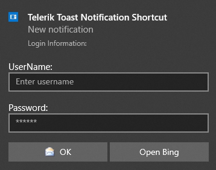

## Adding Toast Notifications Programmatically

The easiest way to produce the XML for your toast notification is via the [RadToastNotifications Editor]() and its **Elements** section on the right. It also allows you to preview the notification while you are designing it.

It is possible to build a **RadToastNotification** at run time, passing the [RadToastTemplateType](https://docs.telerik.com/devtools/winforms/api/telerik.radtoastnotificationmanager.radtoasttemplatetype) and the XML content if you want to extend the default design.

#### Adding RadToastNotification at RunTime

{{source=..\SamplesCS\ToastNotification\ProgrammaticallyAddedToasts.cs region=ProgrammaticallyAddedNotifications}} 
{{source=..\SamplesVB\ToastNotification\ProgrammaticallyAddedToasts.vb region=ProgrammaticallyAddedNotifications}}

````C#


````
````VB.NET


````




# See Also

* [Getting Started]()
* [Design Time]()
* [Notification Templates]() 
 
        
