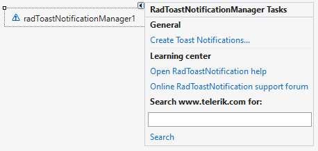
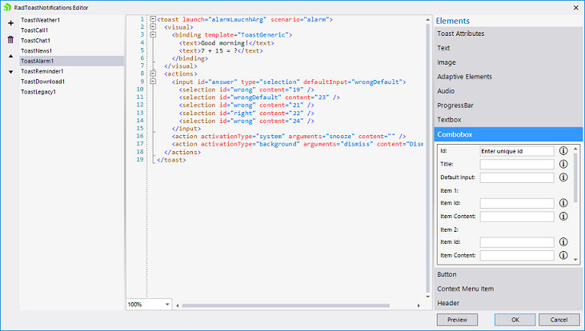

# Design Time  

To start using **RadToastNotificationManager** just drag it from the toolbox and drop it on the form.
 
## Smart Tag

Select **RadToastNotificationManager** from the components tray and click the small arrow at the top right position in order to open the Smart Tag:

 

* General - Click the **Create Toast Notifications...** option to open the **RadToastNotifications Editor**:

 

By using the **+** button, you can add one of the available predefined toast notification templates:

 

The **RadToastNotifications Editor** is divided in 3 main sections. On the left side, you can see all added toast notifications. In the middle section there is a RadSyntaxEditor showing the syntax for the selected toast notification template. On the right side, you have the possibilities to customize the loaded toast notification and add different types of elements and toast attributes to them.

The **Preview** button is quite useful for showing the particular toast notification while you are still designing it. The **OK**/**Cancel** buttons confirms/discard the changes respectively. 

 

* Learning Center: Navigate to the Telerik help, code library projects or support forum.
* Search: Search the Telerik site for a given string.
 

# See Also

* [Getting Started]()
* [Notification Templates]()
 
        
