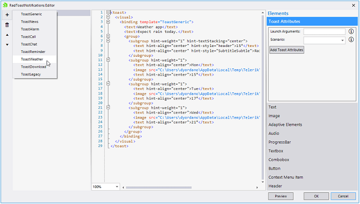
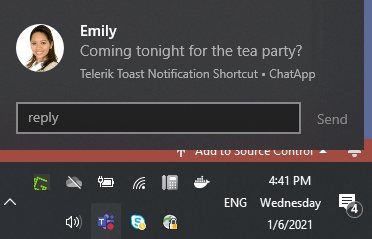

# Getting Started

To start using **RadToastNotificationManager** just drag it from the toolbox and drop it on the form.

### Assembly References

You can find listed below the required references for using a **RadToastNotificationManager** which are automatically added after you drag the **RadToastNotificationManager** from the toolbox:

* Telerik.WinControls.RadToastNotification

* Microsoft.Toolkit.Uwp.Notifications * (necessary for using a custom activator)

>important As of **R2 2021** Toast Notifications are supported in .NET5 and the Microsoft.Toolkit.Uwp.Notifications.dll is upgraded to [version 7](https://github.com/CommunityToolkit/WindowsCommunityToolkit/releases/tag/v7.0.0).

If you want to use RadToastNotificationManager in .NET5/.NET6 and use the design time experience, please make sure that the following requirements are fulfilled: [How to Use ToastNotification in .NET Core/.NET 5/.NET6]() 

>important **RadToastNotificationManager** requires .NET Framework **4.6.1** or higher.

>important Toast notifications can only be displayed in **Windows 8.0** or **higher**. For older Windows versions, use RadDesktopAlert instead.

>note As of R2 2021 Telerik UI for WinForms suite offers **Telerik.WinControls.RadToastNotification.Design.dll** which is a separated assembly from the **Telerik.WinControls.RadToastNotification.dll**. In order to use the design time of **RadToastNotification**, Telerik.WinControls.RadToastNotification.Design.dll is needed in the GAC - same behavior as Telerik.WinControls.UI.Design.dll. The design time also uses Telerik.WinControls.SyntaxEditor.dll.

By using the [RadToastNotifications Editor]() you can add different toast notifications to the manager at design time. They are serialized as Telerik toasts which generate Windows system toasts. 

 

Then, if you want to show a toast notification at run time, e.g. when clicking a button, you must call **ShowNotification** method.
Register RadToastNotificationManager and Show a Notification


#### Show a Notification

{{source=..\SamplesCS\ToastNotification\ToastNotificationGettingStarted.cs region=RegisterGettingStarted}} 
{{source=..\SamplesVB\ToastNotification\ToastNotificationGettingStarted.vb region=RegisterGettingStarted}}

````C#

public ToastNotificationGettingsStarted()
{
    InitializeComponent();

    this.radButton1.Click+=radButton1_Click;
}

private void radButton1_Click(object sender, EventArgs e)
{
    this.radToastNotificationManager1.ShowNotification(3);
}

protected override void OnClosed(EventArgs e)
{
    base.OnClosed(e);
    this.radToastNotificationManager1.Unregister();
}


````
````VB.NET
Public Sub New()
    InitializeComponent()

    AddHandler Me.RadButton1.Click, AddressOf radButton1_Click
End Sub

Private Sub radButton1_Click(ByVal sender As Object, ByVal e As EventArgs)
    Me.radToastNotificationManager1.ShowNotification(3)
End Sub

Protected Overrides Sub OnClosed(ByVal e As EventArgs)
    MyBase.OnClosed(e)
    Me.radToastNotificationManager1.Unregister()
End Sub

````

{{endregion}}

>important The screenshot below is captured under OS Windows 10. The toast notification templates may differ according to the operating system (and OS style theme) that shows them.
  
As a result, the toast notification is successfully shown when you click the button:

 

>important Windows has "Focus Assist' settings where you can choose which notifications you would like to see and hear. The possible options are:
>
* Off - Get all notifications from your apps and contacts.
* Priority only - See only selected notifications from the priority list. The rest will go straight to the action center.
* Alarms only - Hide all notifications, except alarms.
>
If a user has Focus Assist set to Alarms only, he will only see and hear Alarm notifications.


# See Also

* [Notification Templates]()
* [Design Time]()
* [How to Use ToastNotification in .NET Core/.NET 5/.NET6]()
 
        
