# Notification Templates

**RadToastNotificationManager** offers the following built-in toast notification templates:

>important The screenshots below are captured under OS Windows 10. The toast notification templates may differ according to the operating system (and OS style theme) that shows them.  

### ToastGeneric

Generic template used in Windows 10.

````XML
<toast>
  <visual>
    <binding template="ToastGeneric">

    </binding>
  </visual>
</toast>
````

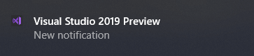 


### ToastNews

News template.

````XML
<toast launch="readMoreArg">
  <visual>
    <binding template="ToastGeneric">
      <text>Wonderman meets Superwoman</text>
      <text>In the eve of the new millennium, Wonderman challenges Superwoman to a bliniking contest.</text>
      <text placement="attribution">Mars Press</text>
    </binding>
  </visual>
</toast>
````

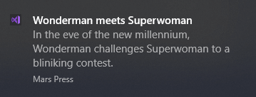 

### ToastAlarm

Alarm template.

````XML
<toast launch="alarmLaucnhArg" scenario="alarm">
  <visual>
    <binding template="ToastGeneric">
      <text>Good morning!</text>
      <text>7 + 15 = ?</text>
    </binding>
  </visual>
  <actions>
    <input id="answer" type="selection" defaultInput="wrongDefault">
      <selection id="wrong" content="19" />
      <selection id="wrongDefault" content="23" />
      <selection id="wrong" content="21" />
      <selection id="right" content="22" />
      <selection id="wrong" content="24" />
    </input>
    <action activationType="system" arguments="snooze" content="" />
    <action activationType="background" arguments="dismiss" content="Dismiss" />
  </actions>
</toast>
````

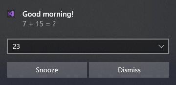 

### ToastCall

Phone Call template.

````XML
<toast launch="callLaunchArg" scenario="incomingCall">
  <visual>
    <binding template="ToastGeneric">
      <text>Phone App</text>
      <text>Incoming Call</text>
      <group>
        <subgroup hint-weight="1" hint-textStacking="center">
          <text hint-align="center" hint-style="Header">Emily Smile</text>
          <image src="C:\Users\furnadzh\AppData\Local\Temp\Telerik\Toast\TA_EmilySmile.png" hint-crop="circle" hint-align="center" />
        </subgroup>
      </group>
    </binding>
  </visual>
  <actions>
    <action content="Text reply" imageUri="C:\Users\dyordano\AppData\Local\Temp\Telerik\Toast\TA_call_message.png" activationType="foreground" arguments="callReply" />
    <action content="Ignore" imageUri="C:\Users\dyordano\AppData\Local\Temp\Telerik\Toast\TA_call_cancel.png" activationType="background" arguments="callIgnore" />
    <action content="Answer" imageUri="C:\Users\dyordano\AppData\Local\Temp\Telerik\Toast\TA_call_telephone.png" arguments="callAnswer" />
  </actions>
</toast>
````

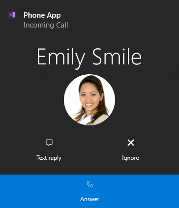 

### ToastChat

Chat template.

````XML
<toast launch="chatLaunchArg">
  <visual>
    <binding template="ToastGeneric">
      <text>Emily</text>
      <text>Coming tonight for the tea party?</text>
      <text hint-maxLines="1" placement="attribution">ChatApp</text>
      <image placement="appLogoOverride" hint-crop="circle" src="C:\Users\dyordano\AppData\Local\Temp\Telerik\Toast\TA_EmilySmile.png" />
    </binding>
  </visual>
  <actions>
    <input id="idTextBox1" type="text" placeHolderContent="reply" />
    <action content="Send" hint-inputId="idTextBox1" activationType="background" arguments="argSendPress" />
  </actions>
</toast>
````

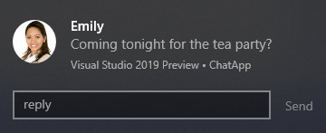 

### ToastReminder

Meeting template.

````XML
<toast launch="reminderLaunchArg" scenario="reminder">
  <visual>
    <binding template="ToastGeneric">
      <text>Daily Meeting</text>
      <text>Conf Room 603</text>
      <text>11:00 AM - 11:15 AM</text>
    </binding>
  </visual>
  <actions>
    <input id="idSnoozeTime" type="selection" defaultInput="5">
      <selection id="1" content="1 minute" />
      <selection id="5" content="5 minutes" />
      <selection id="15" content="15 minutes" />
      <selection id="60" content="1 hour" />
      <selection id="120" content="2 hours" />
    </input>
    <action activationType="system" arguments="snooze" hint-inputId="idSnoozeTime" content="" />
    <action activationType="system" arguments="dismiss" content="" />
  </actions>
</toast>
````

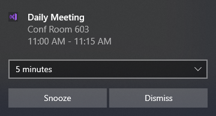 

### ToastWeather

Wheather template.

````XML
<toast>
  <visual>
    <binding template="ToastGeneric">
      <text>Weather app</text>
      <text>Expect rain today.</text>
      <group>
        <subgroup hint-weight="1" hint-textStacking="center">
          <text hint-align="center" hint-style="header">15°</text>
          <text hint-align="center" hint-style="SubtitleSubtle">Rainy</text>
        </subgroup>
        <subgroup hint-weight="1">
          <text hint-align="center">Mon</text>
          <image src="C:\Users\dyordano\AppData\Local\Temp\Telerik\Toast\TA_Weather_Rainy.png" hint-removeMargin="true" />
          <text hint-align="center">15°</text>
        </subgroup>
        <subgroup hint-weight="1">
          <text hint-align="center">Tue</text>
          <image src="C:\Users\dyordano\AppData\Local\Temp\Telerik\Toast\TA_Weather_MostlyCloudy.png" hint-removeMargin="true" />
          <text hint-align="center">17°</text>
        </subgroup>
        <subgroup hint-weight="1">
          <text hint-align="center">Wed</text>
          <image src="C:\Users\dyordano\AppData\Local\Temp\Telerik\Toast\TA_Weather_Sunny.png" hint-removeMargin="true" />
          <text hint-align="center">21°</text>
        </subgroup>
      </group>
    </binding>
  </visual>
</toast>
````

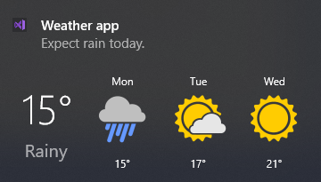 

### ToastDownload

Download template.

````XML
<toast>
  <visual>
    <binding template="ToastGeneric">
      <text>Music Player</text>
      <text>Download Finished</text>
    </binding>
  </visual>
  <actions>
    <action content="Play" activationType="protocol" arguments="C:\Windows\Media\Alarm01.wav" />
    <action content="Open Folder" activationType="protocol" arguments="file:///C:/Windows/Media" />
  </actions>
</toast>
````

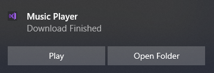 

### ToastLegacy

Legacy template, used in Windows 8. It is not recommended to use it in Windows 10. 

````XML
<toast>
  <visual>
    <binding template="ToastImageAndText04">
      <text id="1">Enter text here</text>
      <text id="1">Enter text here</text>
      <text id="1">Enter text here</text>
      <image id="1" src="C:\Users\dyordano\AppData\Local\Temp\Telerik\Toast\TA_EmilySmile.png" alt="Alternative text"/>
    </binding>
  </visual>
</toast>
````

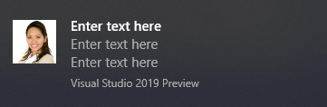 

### Customizing Default Templates

On the right side of the [RadToastNotifications Editor](), you have the possibilities to customize the loaded toast notification and add different [types of elements](https://docs.microsoft.com/en-us/windows/uwp/design/shell/tiles-and-notifications/adaptive-interactive-toasts?tabs=builder-syntax) and toast attributes to them. You can add additional [elements](https://docs.microsoft.com/en-us/windows/uwp/design/shell/tiles-and-notifications/adaptive-interactive-toasts?tabs=builder-syntax) to the toast or remove any of the existing ones by managing the syntax editor in the center.

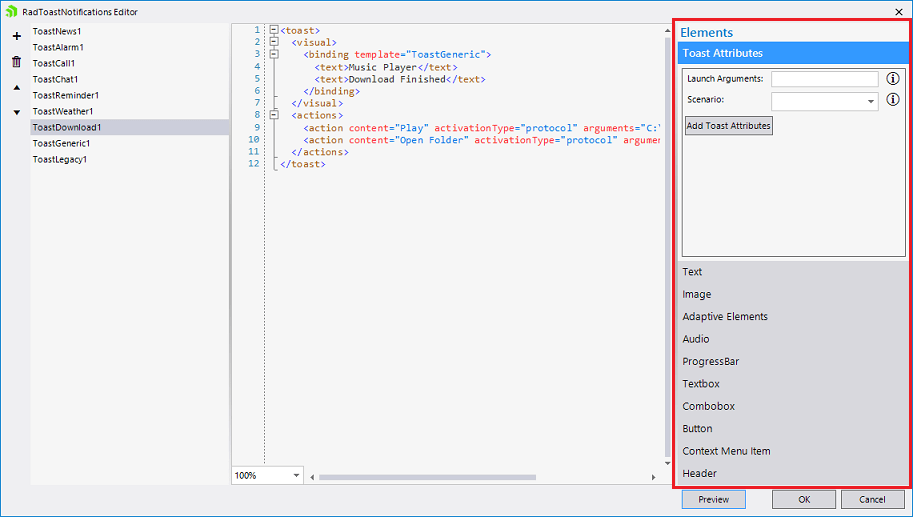

Let's try to extend the **ToastDownload** and add a combo with two items to it. Select the **Combobox** element and fill the data for two items:

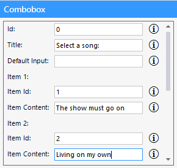

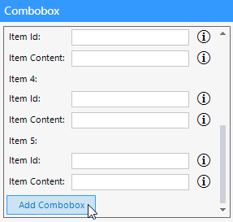

Once you confirm the changes, the syntax code gets updated:

````XML
<toast>
  <visual>
    <binding template="ToastGeneric">
      <text>Music Player</text>
      <text>Download Finished</text>
    </binding>
  </visual>
  <actions>
    <input id="0" title="Select a song:" type="selection">
      <selection id="1" content="The show must go on" />
      <selection id="2" content="Living on my own" />
    </input>
    <action content="Play" activationType="protocol" arguments="C:\Windows\Media\Alarm01.wav" />
    <action content="Open Folder" activationType="protocol" arguments="file:///C:/Windows/Media" />
  </actions>
</toast>
````

Then, the **Preview** button at the bottom right corner of the [RadToastNotifications Editor]() allows you to see the changes that you just made:

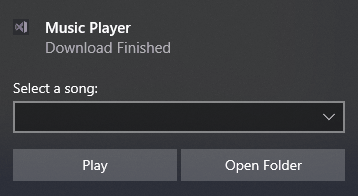

Thus, you can use the Generic template and construct the desired toast from scratch. 

# See Also

* [Getting Started]()
* [Design Time]()
 
        
