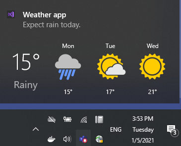
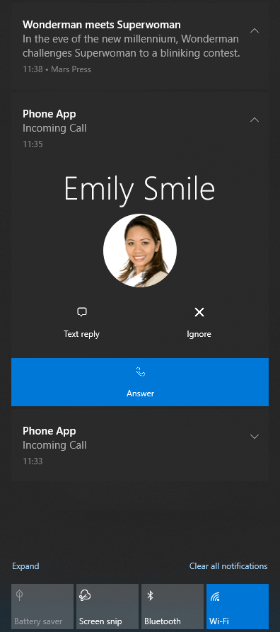

# Toast Notification 

With Windows 8 Microsoft introduced [Toast Notifications](https://docs.microsoft.com/en-us/windows/uwp/design/shell/tiles-and-notifications/toast-ux-guidance) - a notification system like the one in a mobile OS. The **RadToastNotificationManager** component builds notifications on that notification system and expand it, making it easier for our customers to create and manage notifications.  

Toast Notifications are accessed either via the Windows' Action Center or they pop up at the bottom right corner of the monitor. 

#### Toast Notification's Preview

 

#### Toast Notifications in Windows' Action Center

 

## Key Features

Here are a few of the **RadToastNotificationManager**'s main features:

* Notify the user for certain events happening in the work flow. From showing a toast on mail/message arrival, to making a quick reply, this component can be ideal for mail/messaging applications. Notify the user, when there is an update waiting to be installed. 

* You can use it not only to notify the user for certain events, but you can have input from the user. 

* Ability to respond after the application has been closed. The toasts stay in the action center until removed and the user can interact with them, even if the application is already closed. 

* Gallery with predefined notification templates. The design is dependent on the operating system (and its style theme) that shows the notification.

* Preview at design time for the notification templates.

* Ability to customize the default templates and build custom toast notifications. 

* If a user is using Windows 10 Anniversary Update (Redstone 1, build 1607) or later, we can make use of the Generic Template, which is a powerful template for creating rich toasts. [Read more](https://docs.microsoft.com/en-us/windows/uwp/design/shell/tiles-and-notifications/adaptive-interactive-toasts?tabs=builder-syntax) 
 

# See Also

* [Getting Started]()
* [Design Time]()
* [Notification Templates]()
 
        
