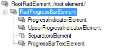
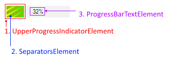

# Control Element Structure

This article describes the inner structure and organization of the elements which build the **RadProgressBar** control.

>caption Figure 1: RadProgressBar's elements hierarchy

>caption Figure 2: RadProgressBar visual structure

The __RadProgressBarElement__ represents the entire __RadProgressBar__ control. Any settings you make at this level will be inherited by all elements further down in the tree.

* **UpperProgressIndicatorElement** and **ProgressIndicatorElement** get an instance of the elements that represent the progress indicators of the progress bar.
        
* **SeparatorsElement** Gets an instance of the element that represents the separators on the progress bar indicator.

* The **ProgressBarTextElement** draws the text on the progress bar.

# See Also

* [Getting Started]()
            
