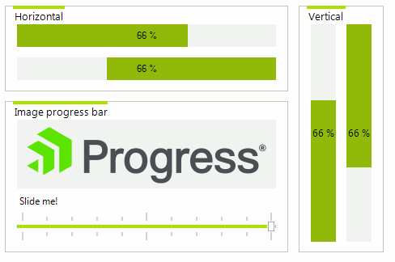
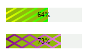

# WinForms ProgressBar Overview

__RadProgressBar__ is designed to display progress information to the user during a long-running operation. It uses Telerik Presentation Framework for [theming]() which alllows several advantages over the standard Windows Forms ProgressBar control. It supports displaying text and images within the body of the progress bar, dashed and cross-hatched indicator styles as well as two values on a single progress bar. The second value being indicated by a change in shade in the unfilled portion of the progress bar.





Dashed and cross-hatched indicator styles

>tip In the related [Getting Started](https://docs.telerik.com/devtools/winforms/controls/track-and-status-controls/progressbar/getting-started) article you can find how to use the control with a sample scenario.

> Download and check out the online demo at [demos.telerik.com](https://telerik-winforms-demos.s3.amazonaws.com/TelerikWinFormsExamplesLauncher.exe)

## Telerik UI for WinForms Learning Resources
* [Telerik UI for WinForms ProgressBar Homepage](https://www.telerik.com/products/winforms/progressbar.aspx)
* [Get Started with the Telerik UI for WinForms ProgressBar]()
* [Telerik UI for WinForms API Reference](https://docs.telerik.com/devtools/winforms/api/)
* [Getting Started with Telerik UI for WinForms Components]()
* [Telerik UI for WinForms Virtual Classroom (Training Courses for Registered Users)](https://learn.telerik.com/learn/course/external/view/elearning/17/TelerikUIforWinForms) 
* [Telerik UI for WinForms Forum](https://www.telerik.com/forums/winforms)
* [Telerik UI for WinForms Knowledge Base](https://docs.telerik.com/devtools/winforms/knowledge-base)

# See Also

* [Getting Started]()
* [Structure]()
* [Properties, Methods and Events]()
* [Accessing and Customizing Elements]()
