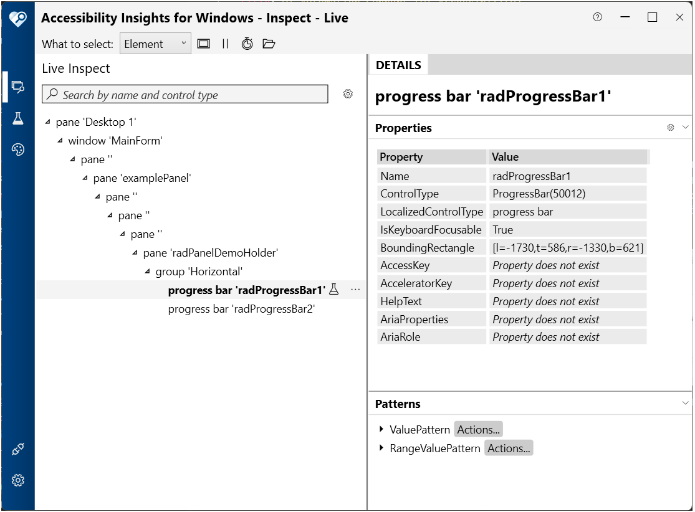

# UI Automation Support

With the __Q3 2025__ version of our controls, RadProgressBar supports UI Automation. The current implementation of UI Automation for RadProgressBar is based on the __MS WinForms ProgressBar Control Type__ standard. The main goal of this implementation is to ensure compliance with accessibility standards and to provide a common practice for automated testing. 



| **Control View**|
|------------------------|
| └─ [ProgressBar](https://learn.microsoft.com/en-us/dotnet/framework/ui-automation/ui-automation-support-for-the-progressbar-control-type) (RadProgressBar Control)|

RadProgressBar is exposed as a single UI Automation element with no child elements. The control implements the standard ProgressBar control type, making it accessible to screen readers and automation tools.

This functionality is enabled by default. To disable it, you can set the __EnableUIAutomation__ property to false.

````C#

this.radProgressBar1.EnableUIAutomation = false;

````
````VB.NET

Me.radProgressBar1.EnableUIAutomation = False

````

## Relevant Properties 

The table below outlines the __UI Automation__ properties most important for understanding and interacting with the RadProgressBar control.

### RadProgressBarUIAutomationProvider

The **RadProgressBarUIAutomationProvider** is the main provider for RadProgressBar, inheriting from **RadControlBaseRootUIAutomationProvider<RadProgressBar>**. It exposes the control as a standard ProgressBar control type with read-only value reporting capabilities.

#### Supported Properties

* AutomationElementIdentifiers.ControlTypeProperty.Id => ControlType.ProgressBar.Id (50012)
* AutomationElementIdentifiers.LocalizedControlTypeProperty.Id => "progress bar"
* AutomationElementIdentifiers.IsContentElementProperty.Id => true
* AutomationElementIdentifiers.IsControlElementProperty.Id => true
* AutomationElementIdentifiers.IsKeyboardFocusableProperty.Id => true
* AutomationElementIdentifiers.HelpTextProperty.Id => Owner.AccessibleDescription
* AutomationElementIdentifiers.BoundingRectangleProperty.Id => Control's screen bounds
* AutomationElementIdentifiers.IsRangeValuePatternAvailableProperty.Id => true
* AutomationElementIdentifiers.IsValuePatternAvailableProperty.Id => true

#### Supported Automation Patterns

The following items outline the automation patterns supported by **RadProgressBarUIAutomationProvider**.

* [Range Value Pattern](https://learn.microsoft.com/en-us/dotnet/api/system.windows.automation.provider.irangevalueprovider?view=windowsdesktop-9.0)
* [Value Pattern](https://learn.microsoft.com/en-us/dotnet/api/system.windows.automation.provider.ivalueprovider?view=windowsdesktop-9.0)

## Automation Events

RadProgressBar raises UI Automation property changed events when the progress value changes:

* **RangeValuePatternIdentifiers.ValueProperty** — Raised when Value1 changes, allowing automation clients and screen readers to be notified of progress updates in real-time

## See Also

* [ProgressBar Control Type (Microsoft Documentation)](https://learn.microsoft.com/en-us/dotnet/framework/ui-automation/ui-automation-support-for-the-progressbar-control-type)
* [IRangeValueProvider Interface](https://learn.microsoft.com/en-us/dotnet/api/system.windows.automation.provider.irangevalueprovider?view=windowsdesktop-9.0)
* [IValueProvider Interface](https://learn.microsoft.com/en-us/dotnet/api/system.windows.automation.provider.ivalueprovider?view=windowsdesktop-9.0)


