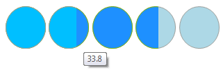

# Customization

## Hover, selected and selecting Background

__RadRating__ introduces an easy way to customize the item’s **BackColor** when hovering, selecting, selected a value:

{{source=..\SamplesCS\TrackAndStatus\Rating\RatingGettingStarted.cs region=Background}} 
{{source=..\SamplesVB\TrackAndStatus\Rating\RatingGettingStarted.vb region=Background}} 

````C#
            
foreach (RatingStarVisualElement item in this.radRating1.Items)
{
    item.Fill.BackColor = Color.LightBlue;
    item.HoverElement.Fill.BackColor = Color.DeepSkyBlue;
    item.ValueElement.Fill.BackColor = Color.DodgerBlue;
    item.SelectedValueElement.Fill.BackColor = Color.Blue;
    item.Fill.GradientStyle = Telerik.WinControls.GradientStyles.Solid;
    item.HoverElement.Fill.GradientStyle = Telerik.WinControls.GradientStyles.Solid;
    item.ValueElement.Fill.GradientStyle = Telerik.WinControls.GradientStyles.Solid;
    item.SelectedValueElement.Fill.GradientStyle = GradientStyles.Solid;
}

````
````VB.NET
For Each item As RatingStarVisualElement In Me.RadRating1.Items
    item.Fill.BackColor = Color.LightBlue
    item.HoverElement.Fill.BackColor = Color.DeepSkyBlue
    item.ValueElement.Fill.BackColor = Color.DodgerBlue
    item.SelectedValueElement.Fill.BackColor = Color.Blue
    item.Fill.GradientStyle = Telerik.WinControls.GradientStyles.Solid
    item.HoverElement.Fill.GradientStyle = Telerik.WinControls.GradientStyles.Solid
    item.ValueElement.Fill.GradientStyle = Telerik.WinControls.GradientStyles.Solid
    item.SelectedValueElement.Fill.GradientStyle = GradientStyles.Solid
Next

````

{{endregion}} 

>caption Figure 1: Default look


>caption Figure 2: Customized look


## Custom Shape

By default __RadRating__ supports three main element shapes: Stars, Diamonds and Hearts. If a different kind of shape is needed, __RadRating__ allows you to create and use your own custom visual elements. The following example demonstrates creating a circle visual element:

{{source=..\SamplesCS\TrackAndStatus\Rating\RatingGettingStarted.cs region=CustomShape}} 
{{source=..\SamplesVB\TrackAndStatus\Rating\RatingGettingStarted.vb region=CustomShape}} 

````C#
            
for (int i = 0; i < 5; i++)
{
    CustomShapeElement myShape = new CustomShapeElement();
    myShape.Fill.BackColor = Color.LightBlue;
    myShape.HoverElement.Fill.BackColor = Color.DeepSkyBlue;
    myShape.ValueElement.Fill.BackColor = Color.DodgerBlue;
    myShape.SelectedValueElement.Fill.BackColor = Color.Blue;  
    
    myShape.Fill.GradientStyle = Telerik.WinControls.GradientStyles.Solid;
    myShape.HoverElement.Fill.GradientStyle = Telerik.WinControls.GradientStyles.Solid;
    myShape.ValueElement.Fill.GradientStyle = Telerik.WinControls.GradientStyles.Solid;
    myShape.SelectedValueElement.Fill.GradientStyle = GradientStyles.Solid;
    this.radRating1.Items.Add(myShape);
}

````
````VB.NET
For i As Integer = 0 To 4
    Dim myShape As New CustomShapeElement()
    myShape.Fill.BackColor = Color.LightBlue
    myShape.HoverElement.Fill.BackColor = Color.DeepSkyBlue
    myShape.ValueElement.Fill.BackColor = Color.DodgerBlue
    myShape.SelectedValueElement.Fill.BackColor = Color.Blue
    myShape.Fill.GradientStyle = Telerik.WinControls.GradientStyles.Solid
    myShape.HoverElement.Fill.GradientStyle = Telerik.WinControls.GradientStyles.Solid
    myShape.ValueElement.Fill.GradientStyle = Telerik.WinControls.GradientStyles.Solid
    myShape.SelectedValueElement.Fill.GradientStyle = GradientStyles.Solid
    Me.RadRating1.Items.Add(myShape)
Next

````

{{endregion}}

{{source=..\SamplesCS\TrackAndStatus\Rating\RatingGettingStarted.cs region=CustomShapeClasses}} 
{{source=..\SamplesVB\TrackAndStatus\Rating\RatingGettingStarted.vb region=CustomShapeClasses}} 

````C#
    
public class CustomShapeElement : RatingVisualElement
{
    protected override ElementShape GetShape()
    {
        return new CustomShape();
    }
        
    protected override Type ThemeEffectiveType
    {
        get
        {
            return typeof(RatingVisualElement);
        }
    }
}
    
public class CustomShape : ElementShape
{
    public override GraphicsPath CreatePath(Rectangle bounds)
    {
        GraphicsPath path = new GraphicsPath();
        path.AddEllipse(bounds);
    
        return path;
    }
}

````
````VB.NET
Public Class CustomShapeElement
Inherits RatingVisualElement
    Protected Overrides Function GetShape() As ElementShape
        Return New CustomShape()
    End Function
    Protected Overrides ReadOnly Property ThemeEffectiveType() As Type
        Get
            Return GetType(RatingVisualElement)
        End Get
    End Property
End Class
Public Class CustomShape
Inherits ElementShape
    Public Overrides Function CreatePath(bounds As Rectangle) As GraphicsPath
        Dim path As New GraphicsPath()
        path.AddEllipse(bounds)
        Return path
    End Function
End Class

````

{{endregion}} 


