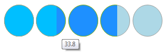

# Customization

## Hover, selected and selecting Background

__RadRating__ introduces an easy way to customize the item’s **BackColor** when hovering, selecting, selected a value:

<snippet id='track-and-status-controls-ratinggettingstarted-background-cs' />
<snippet id='track-and-status-controls-ratinggettingstarted-background-vb' />

>caption Figure 1: Default look

>caption Figure 2: Customized look

## Custom Shape

By default __RadRating__ supports three main element shapes: Stars, Diamonds and Hearts. If a different kind of shape is needed, __RadRating__ allows you to create and use your own custom visual elements. The following example demonstrates creating a circle visual element:

<snippet id='track-and-status-controls-ratinggettingstarted-customshape-cs' />
<snippet id='track-and-status-controls-ratinggettingstarted-customshape-vb' />

<snippet id='track-and-status-controls-ratinggettingstarted-customshapeclasses-cs' />
<snippet id='track-and-status-controls-ratinggettingstarted-customshapeclasses-vb' />

