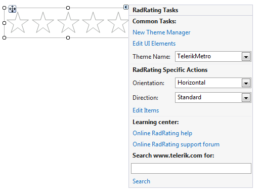
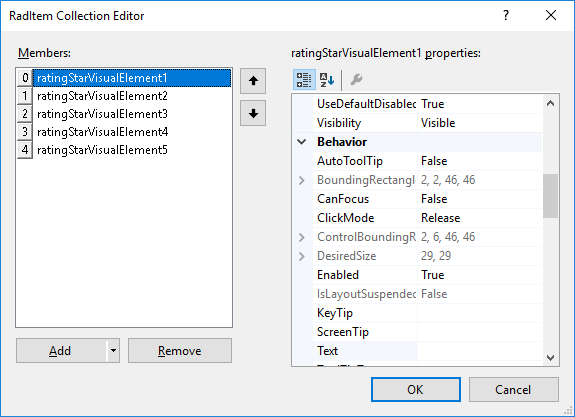

# Design time

To start using **RadRating** just drag it from toolbox and drop it at the form.

Select **RadRating** and click the small arrow on the top right position in order to open the *Smart Tag*. The *Smart Tag* of __RadRating__ lets you quickly configure your control.

>caption Figure 1: Smart Tag

* __New Theme Manager__: adds a new __RadThemeManager__ component to the form.
            
* __Edit UI Elements__: allows setting properties at multiple levels of the class hierarchy.
            
* __Orientation__: determines the orientation of **RadRating**.

* __Direction__: determines whether the direction is standard or reversed.
            
* __Edit Items__: opens the *RadItem Collection Editor* allowing to add/remove items. Adding items to __RadRating__ at design time is possible through the **Items** collection of the control as well which can be accessed in the property grid. 

>caption Figure 2: RadItem Collection Editor

 

By clicking the `Add` button you can add items to the collection. Additionally, on the right hand side, you will see a property grid, where you can change the properties of each item individually.        
           
* __Learning Center__: Navigate to the Telerik help, code library projects or support forum.

* __Search__: Search the Telerik site for a given string.         
        
# See Also

* [Element Hierarchy Editor]()
* [Using default themes]()
* [Structure]()	
* [Getting Started]()	

