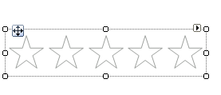
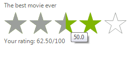

# Getting Started with WinForms Rating

This tutorial will help you to quickly get started using the control.

## Adding Telerik Assemblies Using NuGet

To use `RadRating` when working with NuGet packages, install the `Telerik.UI.for.WinForms.AllControls` package. The [package target framework version may vary]().

Read more about NuGet installation in the [Install using NuGet Packages]() article.

>tip With the 2025 Q1 release, the Telerik UI for WinForms has a new licensing mechanism. You can learn more about it [here]().

## Adding Assembly References Manually

When dragging and dropping a control from the Visual Studio (VS) Toolbox onto the Form Designer, VS automatically adds the necessary assemblies. However, if you're adding the control programmatically, you'll need to manually reference the following assemblies:

* __Telerik.Licensing.Runtime__
* __Telerik.WinControls__
* __Telerik.WinControls.UI__
* __TelerikCommon__

The Telerik UI for WinForms assemblies can be install by using one of the available [installation approaches](). 

## Defining the RadRating

Below are the basic steps needed to get started with __RadRating__ control in Visual Studio:

1\. Drag __RadRating__ from the Visual Studio Toolbox to the form.

1. Set the *Caption* to *“The best movie ever”*.

1. Set the **SelectionMode** property to *HalfItem*.

1. In the code behind subscribe to the **ValueChanged** event, where you can calculate and display the average rating:

#### Handling the ValueChanged event

<snippet id='track-and-status-controls-ratinggettingstarted-gettingstarted-cs' />
<snippet id='track-and-status-controls-ratinggettingstarted-gettingstarted-vb' />

5\. Press F5 to run the application.

## See Also

* [Structure]()	
* [Design Time]()	

## Telerik UI for WinForms Learning Resources
* [Telerik UI for WinForms Rating Component](https://www.telerik.com/products/winforms/rating.aspx)
* [Getting Started with Telerik UI for WinForms Components](https://docs.telerik.com/devtools/winforms/getting-started/first-steps)
* [Telerik UI for WinForms Setup](https://docs.telerik.com/devtools/winforms/installation-and-upgrades/installing-on-your-computer)
* [Telerik UI for WinForms Converter](https://www.telerik.com/products/winforms/documentation/ai-coding-assistant/converter/converter)
* [Telerik UI for WinForms Visual Studio Templates](https://docs.telerik.com/devtools/winforms/visual-studio-integration/visual-studio-templates)
* [Deploy Telerik UI for WinForms Applications](https://docs.telerik.com/devtools/winforms/deployment-and-distribution/application-deployment)
* [Telerik UI for WinForms Virtual Classroom(Training Courses for Registered Users)](https://learn.telerik.com/learn/course/external/view/elearning/17/telerik-ui-for-winforms)
* [Telerik UI for WinForms License Agreement)](https://www.telerik.com/purchase/license-agreement/winforms-dlw-s)

