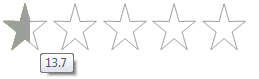

# Properties

|Property|Description|
|----|----|
|**Direction**|Gets or sets the direction of rating element paint (Standard, Reversed).|
|**Orientation**|Gets or sets the orientation of the rating control.|
|**SelectionMode**|Gets or sets the selection mode of the rating control.|
|**Items**|Gets the rating items collection.|
|**Value**|Gets or sets the average value of rating element.|
|**Minimum**|Gets or sets the minimum value of rating element.|
|**Maximum**|Gets or sets the maximum value of rating element.|
|**Caption**|Gets or sets the text of the Caption label.|
|**Subcaption**|Gets or sets the text of the Sub Caption label.|
|**Description**|Gets or sets the text of the description label.|
|**RatingElement**|Gets the instance of RadRatingElement wrapped by this control. RadRatingElement is the main element in the hierarchy tree and encapsulates the actual functionality of RadRating.|
|**ReadOnly**|Gets or sets whether the rating is ReadOnly. The Value of the element can still be set in ReadOnly mode, nothing else.|

# RadRatingElement's properties

|Property|Description|
|----|----|
|**CaptionElement**|Gets the caption element.|
|**SubCaptionElement**|Gets the sub caption element.|
|**DescriptionElement**|Gets the description element.|
|**ElementsLayout**|Gets the elements layout.|
|**ToolTipFormatString**|Gets or sets the tool tip format string.|
|**SelectedValue**|Gets or sets the selected value.|
|**HoverValue**|Gets or sets the hover value.|
|**ToolTipPrecision**|Gets or sets the tool tip precision.|
|**PercentageRounding**|Gets or sets the percentage rounding.|
|**ToolTipOffset**|Gets or sets the tool tip offset.|
|**ToolTipDuration**|Gets or sets the duration of the tool tip.|
|**ShowItemToolTips**|Determines whether the tool tips are shown when hovering the items.|

# Events

|Event|Description|
|----|----|
|**ValueChanging**|Occurs when the value is being changed. Cancelable event.|
|**ValueChanged**|Occurs before the value of the RatingElement is changed.|

You can find below how to set the aforementioned properties and how they affect **RadRating**:

* **ShowItemToolTips** - by default __RadRating__ shows tooltips when hovering the items. The user can disable this functionality by setting *ShowItemToolTips* property to False:

{{source=..\SamplesCS\TrackAndStatus\Rating\RatingGettingStarted.cs region=ShowItemToolTips}} 
{{source=..\SamplesVB\TrackAndStatus\Rating\RatingGettingStarted.vb region=ShowItemToolTips}} 

````C#
this.radRating1.ShowItemToolTips = false;

````
````VB.NET
Me.RadRating1.ShowItemToolTips = False

````

{{endregion}} 

|ShowItemToolTips=false|ShowItemToolTips=true|
|----|----|
|||


* **RightToLeft** - __RadRating__ supports **RightToLeft** functionality. It is disabled by default, so you should enable it:

{{source=..\SamplesCS\TrackAndStatus\Rating\RatingGettingStarted.cs region=RightToLeft}} 
{{source=..\SamplesVB\TrackAndStatus\Rating\RatingGettingStarted.vb region=RightToLeft}} 

````C#
            
this.radRating1.RightToLeft = System.Windows.Forms.RightToLeft.Yes;

````
````VB.NET
Me.RadRating1.RightToLeft = System.Windows.Forms.RightToLeft.Yes

````

{{endregion}} 

|RightToLeft=false|RightToLeft=true|
|----|----|
|||

* *Direction* property can be used to control the hover direction.

{{source=..\SamplesCS\TrackAndStatus\Rating\RatingGettingStarted.cs region=Direction}} 
{{source=..\SamplesVB\TrackAndStatus\Rating\RatingGettingStarted.vb region=Direction}} 

````C#
            
this.radRating1.Direction = RatingDirection.Reversed;

````
````VB.NET
Me.RadRating1.Direction = RatingDirection.Reversed

````

{{endregion}} 

|Direction=Standard|Direction=Reversed|
|----|----|
|||

* **Orientation** - the default __RadRating__ orientation is *Horizontal*. It is allowed to change it to Vertical:

{{source=..\SamplesCS\TrackAndStatus\Rating\RatingGettingStarted.cs region=Orientation}} 
{{source=..\SamplesVB\TrackAndStatus\Rating\RatingGettingStarted.vb region=Orientation}} 

````C#
            
this.radRating1.Orientation = Orientation.Vertical;
this.radRating1.AutoSize = true;

````
````VB.NET
Me.RadRating1.Orientation = Orientation.Vertical
Me.RadRating1.AutoSize = True

````

{{endregion}} 

|Orientation=Horizontal|Orientation=Vertical|
|----|----|
|||

* **Caption, Subcaption and Description** – specify texts for the captions of __RadRating__:

{{source=..\SamplesCS\TrackAndStatus\Rating\RatingGettingStarted.cs region=Captions}} 
{{source=..\SamplesVB\TrackAndStatus\Rating\RatingGettingStarted.vb region=Captions}} 

````C#
            
this.radRating1.Caption = "Rate the movie";
this.radRating1.Description = "Description";
this.radRating1.Subcaption = "SubCaption";

````
````VB.NET
Me.RadRating1.Caption = "Rate the movie"
Me.RadRating1.Description = "Description"
Me.RadRating1.Subcaption = "SubCaption"

````

{{endregion}} 


* **SelectionMode** - determines how precisely the user will select the value:

#### RatingSelectionMode.Precise

{{source=..\SamplesCS\TrackAndStatus\Rating\RatingGettingStarted.cs region=SelectionPrecise}} 
{{source=..\SamplesVB\TrackAndStatus\Rating\RatingGettingStarted.vb region=SelectionPrecise}} 

````C#
            
this.radRating1.SelectionMode = Telerik.WinControls.UI.RatingSelectionMode.Precise;

````
````VB.NET
Me.RadRating1.SelectionMode = Telerik.WinControls.UI.RatingSelectionMode.Precise

````

{{endregion}} 

#### RatingSelectionMode.HalfItem

{{source=..\SamplesCS\TrackAndStatus\Rating\RatingGettingStarted.cs region=SelectionHalfItem}} 
{{source=..\SamplesVB\TrackAndStatus\Rating\RatingGettingStarted.vb region=SelectionHalfItem}} 

````C#
this.radRating1.SelectionMode = Telerik.WinControls.UI.RatingSelectionMode.HalfItem;

````
````VB.NET
Me.RadRating1.SelectionMode = Telerik.WinControls.UI.RatingSelectionMode.HalfItem

````

{{endregion}} 

#### RatingSelectionMode.FullItem

{{source=..\SamplesCS\TrackAndStatus\Rating\RatingGettingStarted.cs region=SelectionFullItem}} 
{{source=..\SamplesVB\TrackAndStatus\Rating\RatingGettingStarted.vb region=SelectionFullItem}} 

````C#
this.radRating1.SelectionMode = Telerik.WinControls.UI.RatingSelectionMode.FullItem;

````
````VB.NET
Me.RadRating1.SelectionMode = Telerik.WinControls.UI.RatingSelectionMode.FullItem

````

{{endregion}} 

|SelectionMode=FullItem|SelectionMode=HalfItem|SelectionMode=Precise|
|----|----|----|
||||

* **Minimum** and **Maximum** – specifies the range of __RadRating__:

#### Specify minimum/maximum

{{source=..\SamplesCS\TrackAndStatus\Rating\RatingGettingStarted.cs region=Ranges}} 
{{source=..\SamplesVB\TrackAndStatus\Rating\RatingGettingStarted.vb region=Ranges}} 

````C#
            
this.radRating1.Minimum = 10;
this.radRating1.Maximum = 40;

````
````VB.NET
Me.RadRating1.Minimum = 10
Me.RadRating1.Maximum = 40

````

{{endregion}} 



* **Value** - sets or gets the value of the __RadRating__:

{{source=..\SamplesCS\TrackAndStatus\Rating\RatingGettingStarted.cs region=Value}} 
{{source=..\SamplesVB\TrackAndStatus\Rating\RatingGettingStarted.vb region=Value}} 

````C#
this.radRating1.Value = 43.4;

````
````VB.NET
Me.RadRating1.Value = 43.4

````

{{endregion}} 

# See Also

* [Properties](http://docs.telerik.com/devtools/winforms/api/html/properties_t_telerik_wincontrols_ui_radrating.htm)
* [Methods](http://docs.telerik.com/devtools/winforms/api/html/methods_t_telerik_wincontrols_ui_radrating.htm)
* [Events](http://docs.telerik.com/devtools/winforms/api/html/events_t_telerik_wincontrols_ui_radrating.htm)