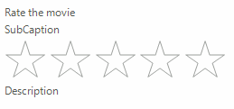
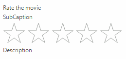

# Properties

|Property|Description|
|----|----|
|**Direction**|Gets or sets the direction of rating element paint (Standard, Reversed).|
|**Orientation**|Gets or sets the orientation of the rating control.|
|**SelectionMode**|Gets or sets the selection mode of the rating control.|
|**Items**|Gets the rating items collection.|
|**Value**|Gets or sets the average value of rating element.|
|**Minimum**|Gets or sets the minimum value of rating element.|
|**Maximum**|Gets or sets the maximum value of rating element.|
|**Caption**|Gets or sets the text of the Caption label.|
|**Subcaption**|Gets or sets the text of the Sub Caption label.|
|**Description**|Gets or sets the text of the description label.|
|**RatingElement**|Gets the instance of RadRatingElement wrapped by this control. RadRatingElement is the main element in the hierarchy tree and encapsulates the actual functionality of RadRating.|
|**ReadOnly**|Gets or sets whether the rating is ReadOnly. The Value of the element can still be set in ReadOnly mode, nothing else.|

# RadRatingElement's properties

|Property|Description|
|----|----|
|**CaptionElement**|Gets the caption element.|
|**SubCaptionElement**|Gets the sub caption element.|
|**DescriptionElement**|Gets the description element.|
|**ElementsLayout**|Gets the elements layout.|
|**ToolTipFormatString**|Gets or sets the tool tip format string.|
|**SelectedValue**|Gets or sets the selected value.|
|**HoverValue**|Gets or sets the hover value.|
|**ToolTipPrecision**|Gets or sets the tool tip precision.|
|**PercentageRounding**|Gets or sets the percentage rounding.|
|**ToolTipOffset**|Gets or sets the tool tip offset.|
|**ToolTipDuration**|Gets or sets the duration of the tool tip.|
|**ShowItemToolTips**|Determines whether the tool tips are shown when hovering the items.|

# Events

|Event|Description|
|----|----|
|**ValueChanging**|Occurs when the value is being changed. Cancelable event.|
|**ValueChanged**|Occurs before the value of the RatingElement is changed.|

You can find below how to set the aforementioned properties and how they affect **RadRating**:

* **ShowItemToolTips** - by default __RadRating__ shows tooltips when hovering the items. The user can disable this functionality by setting *ShowItemToolTips* property to False:

<snippet id='track-and-status-controls-ratinggettingstarted-showitemtooltips-cs' />
<snippet id='track-and-status-controls-ratinggettingstarted-showitemtooltips-vb' />

|ShowItemToolTips=false|ShowItemToolTips=true|
|----|----|
|||

* **RightToLeft** - __RadRating__ supports **RightToLeft** functionality. It is disabled by default, so you should enable it:

<snippet id='track-and-status-controls-ratinggettingstarted-righttoleft-cs' />
<snippet id='track-and-status-controls-ratinggettingstarted-righttoleft-vb' />

|RightToLeft=false|RightToLeft=true|
|----|----|
|||

* *Direction* property can be used to control the hover direction.

<snippet id='track-and-status-controls-ratinggettingstarted-direction-cs' />
<snippet id='track-and-status-controls-ratinggettingstarted-direction-vb' />

|Direction=Standard|Direction=Reversed|
|----|----|
|||

* **Orientation** - the default __RadRating__ orientation is *Horizontal*. It is allowed to change it to Vertical:

<snippet id='track-and-status-controls-ratinggettingstarted-orientation-cs' />
<snippet id='track-and-status-controls-ratinggettingstarted-orientation-vb' />

|Orientation=Horizontal|Orientation=Vertical|
|----|----|
|||

* **Caption, Subcaption and Description** – specify texts for the captions of __RadRating__:

<snippet id='track-and-status-controls-ratinggettingstarted-captions-cs' />
<snippet id='track-and-status-controls-ratinggettingstarted-captions-vb' />

* **SelectionMode** - determines how precisely the user will select the value:

#### RatingSelectionMode.Precise

<snippet id='track-and-status-controls-ratinggettingstarted-selectionprecise-cs' />
<snippet id='track-and-status-controls-ratinggettingstarted-selectionprecise-vb' />

#### RatingSelectionMode.HalfItem

<snippet id='track-and-status-controls-ratinggettingstarted-selectionhalfitem-cs' />
<snippet id='track-and-status-controls-ratinggettingstarted-selectionhalfitem-vb' />

#### RatingSelectionMode.FullItem

<snippet id='track-and-status-controls-ratinggettingstarted-selectionfullitem-cs' />
<snippet id='track-and-status-controls-ratinggettingstarted-selectionfullitem-vb' />

|SelectionMode=FullItem|SelectionMode=HalfItem|SelectionMode=Precise|
|----|----|----|
||||

* **Minimum** and **Maximum** – specifies the range of __RadRating__:

#### Specify minimum/maximum

<snippet id='track-and-status-controls-ratinggettingstarted-ranges-cs' />
<snippet id='track-and-status-controls-ratinggettingstarted-ranges-vb' />

* **Value** - sets or gets the value of the __RadRating__:

<snippet id='track-and-status-controls-ratinggettingstarted-value-cs' />
<snippet id='track-and-status-controls-ratinggettingstarted-value-vb' />

# See Also

* [Properties](https://docs.telerik.com/devtools/winforms/api/telerik.wincontrols.ui.radrating.html#properties)
* [Methods](https://docs.telerik.com/devtools/winforms/api/telerik.wincontrols.ui.radrating.html#methods)
* [Events](https://docs.telerik.com/devtools/winforms/api/telerik.wincontrols.ui.radrating.html#events)
