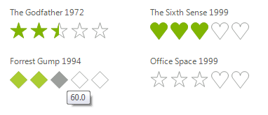

# Rating

__RadRating__ is a flexible UI component that allows users to place their rating by selecting from a finite number of items (stars, diamonds and hearts). The developers can fully customize the control by configuring its orientation, rating precision, direction etc.

## Key features:

* Horizontal/Vertical Orientation

* Direction

* Selection

* Caption

* Subcaption 

* Description

# See Also

* [Structure]()	
* [Design Time]()	
* [Getting Started]()