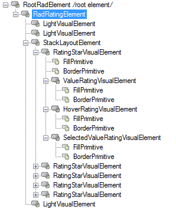
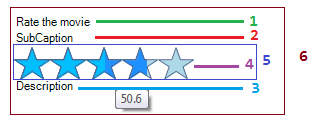

# Structure

This article illustrates the inner structure and organization of the elements which build the **RadRating** control.

>caption Figure 1: RadRating's elements hierarchy

>caption Figure 2: RadRating's visual structure

1. Caption Element (Light Visual Element) 

1. Sub caption Element (Light Visual Element)

1. Description Element (Light Visual Element)

1. Rating Item Element (Light Visual Element)

1. Stack Layout Element

1. Stack Layout Element

# See Also

* [RadControlSpy]()
