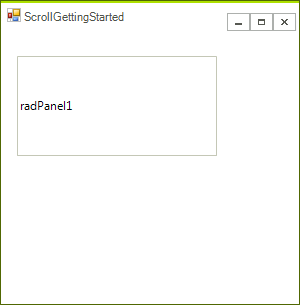
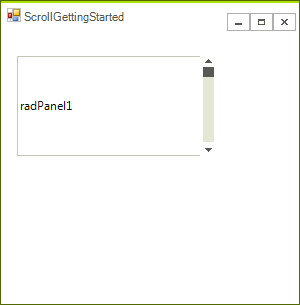
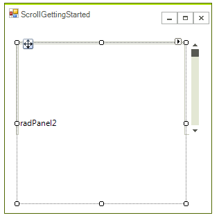
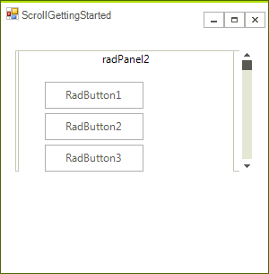
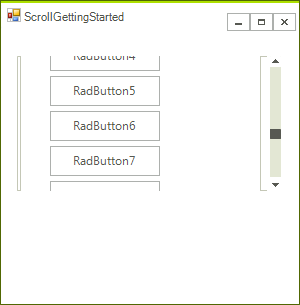

# Getting Started with WinForms ScrollBar

This tutorial will help you to quickly get started using the control.

## Adding Telerik Assemblies Using NuGet

To use `RadScrollBar` when working with NuGet packages, install the `Telerik.UI.for.WinForms.AllControls` package. The [package target framework version may vary]().

Read more about NuGet installation in the [Install using NuGet Packages]() article.

>tip With the 2025 Q1 release, the Telerik UI for WinForms has a new licensing mechanism. You can learn more about it [here]().

## Adding Assembly References Manually

When dragging and dropping a control from the Visual Studio (VS) Toolbox onto the Form Designer, VS automatically adds the necessary assemblies. However, if you're adding the control programmatically, you'll need to manually reference the following assemblies:

* __Telerik.Licensing.Runtime__
* __Telerik.WinControls__
* __Telerik.WinControls.UI__
* __TelerikCommon__

The Telerik UI for WinForms assemblies can be install by using one of the available [installation approaches](). 

## Defining the RadScrollBar

Using Telerik scroll bars is a bit more intricate compared to using the standard scroll bars because you have to handle scroll event manually. The rest of this article demonstrates how you can use two panels to implement scrolling for the content of the second panel.

1\. Add a **RadPanel** to your form (*TelerikMetro* theme was used for both panels. This theme is contained in the Miscellaneous theme component):

2\. Add a **RadVScrollbar** in the panel and dock it to the *Right*:

3\. Add another **RadPanel** in the already added one and set its height to the *total* height you want to be available upon scrolling. This value can be statics e.g. *1000* pixels or dynamic determined by the scrollable content. For the purpose, of this example it is set to *1000* pixels. 

4\. The next step is to add controls to the second **RadPanel** (the controls which are to be scrolled):

#### Adding controls to the panel

<snippet id='track-and-status-controls-scrollgettingstarted-buttons-cs' />
<snippet id='track-and-status-controls-scrollgettingstarted-buttons-vb' />

>note You can add controls by drag and drop at design time as well.
>

5\. Then, subscribe to the **Scroll** event of the vertical scroll bar and assign its negated value to the **Top** property of the second **RadPanel**:

#### Handling the Scroll event

<snippet id='track-and-status-controls-scrollgettingstarted-scroll-cs' />
<snippet id='track-and-status-controls-scrollgettingstarted-scroll-vb' />

6\. The last required step is to set the __Maximum__ property of the scroll bar to reflect the size of the __scrollable height__ which is the __total height__ of the scrollable content minus the __visible height__. For the example of this section in particular, that is the height of the second panel minus the height of the first panel.

#### Specify RadVScrollBar's maximum

<snippet id='track-and-status-controls-scrollgettingstarted-maximum-cs' />
<snippet id='track-and-status-controls-scrollgettingstarted-maximum-vb' />

## See Also

* [Properties, Methods and Events]()	

## Telerik UI for WinForms Learning Resources
* [Telerik UI for WinForms ScrollBar Component](https://www.telerik.com/products/winforms/radvscrollbar.aspx)
* [Getting Started with Telerik UI for WinForms Components](https://docs.telerik.com/devtools/winforms/getting-started/first-steps)
* [Telerik UI for WinForms Setup](https://docs.telerik.com/devtools/winforms/installation-and-upgrades/installing-on-your-computer)
* [Telerik UI for WinForms Application Modernization](https://docs.telerik.com/devtools/winforms/winforms-converter/overview)
* [Telerik UI for WinForms Visual Studio Templates](https://docs.telerik.com/devtools/winforms/visual-studio-integration/visual-studio-templates)
* [Deploy Telerik UI for WinForms Applications](https://docs.telerik.com/devtools/winforms/deployment-and-distribution/application-deployment)
* [Telerik UI for WinForms Virtual Classroom(Training Courses for Registered Users)](https://learn.telerik.com/learn/course/external/view/elearning/17/telerik-ui-for-winforms)
* [Telerik UI for WinForms License Agreement)](https://www.telerik.com/purchase/license-agreement/winforms-dlw-s)

