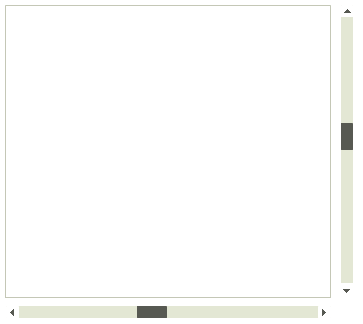

# ScrollBar

__RadHSrollBar__ and __RadVScrollBar__ are themeable alternatives to the standard Windows Forms scroll bar controls. Both are derivatives of **RadScrollBar**. They provide a consistent look and feel with the other Telerik UI for WinForms controls.

# See Also

* [Structure]()	
* [Getting Started]()	