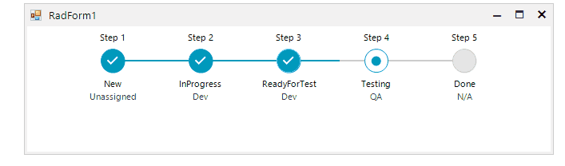

# Customize Step Item 

The __RadStepProgreesBar__ and its __StepProgressItem__ expose various properties which can be used to further customize their visual appearance. In this article we are going to list them. 

## RadStepProgressBar

>The following properties will be applied to all steps inside the control. In a case, where you want to customize specific steps and their connection, please refer to the next section of this article.

### IndicatorSize

Using this property, you can change the size of the indicator shapes. The default size is 30,30. In the following image this property is set to 60,60.

### StepSpacing

Using this property, you can change the space between the steps. The default value is 80. In the following image this property is set to 150.

### ConnectionThickness

Using this property, you can change the connection thickness of the steps. The default value is 3. In the following image this property is set to 8.

### HideConnections

Using this property, you can hide the connection of the steps. In the following image this property is set to __true__.

### NavigationStep

Using this property, you can control the scroll step of the navigation buttons. This property will take affect when the __LayoutMode__ property of the __RadStepProgreesBar__ is set to __Absolute__. The default value is 80. In the following example this property is set to 20 which will slowdown the scrolling process.

  
## StepProgressItem

>The following properties will be applied to the corresponding step. The other steps won't be affected.

### IndicatorSize

Using this property, you can change the size of the step progress item. The default size is 30,30. Setting the property of the step item itself will not affect the size of the other steps. If this property is used, the property will unbind from the RadStepProgressBar IndicatorSize property. To bind it again, you can call the __ResetIndicatorSize()__ method of the item.

### ConnectionLength

Using this property, you can control the connection lenght. The default value is 80. Setting the property of the step item itself will not affect the length of the other connections. If this property is used, the property will unbind from the RadStepProgressBar __StepSpacing__ property. To bind it again, you can call the __ResetConnectionLength()__ method of the item.

### ConnectionThickness

Using this property, you can control the connection thickness. The default value is 3. Setting the property of the step item itself will not affect the thickness of the other connections. If this property is used, the property will unbind from the RadStepProgressBar __ConnectionThickness__ property. To bind it again, you can call the __ResetConnectionThickness()__ method of the item.

# See Also

* [Getting Started]()
* [Design Time]() 
* [Structure]() 
 
        
