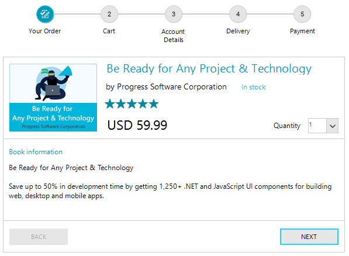

# StepProgressBar 

__RadStepProgressBar__ enables you to set up a visual element that displays a multi-step process via a number of different steps and a progress track bar between each step. This control can be used to track the progress of an ongoing process, booking transport tickets, user registration, etc.

 

## Key Features

Here are a few of the **StepProgressBar**'s main features:

* __Easily customizeable visuals__: The track bar and each step of the control can be customized by changing their default properties (like color and size) or by replacing the default indicator shape with a custom one. Read more it the [Customize Step Item]() section of the documentation.

* __Horizontal and vertical orientations__: The control is arranged horizontally by default (left to right). Additionally, the control can be arranged vertically (top to bottom or bottom to top). Read more in the [Layout]() article.

* __Progress Mode__: The control allows you to change how its steps are related to each other. Read more in the [Step Progress Mode]() article.

* __Theming__ : Like any other control from the UI for WinForms suite, RadStepProgressBar comes with different themes.   
 

# See Also

* [Getting Started]()
* [Design Time]() 
* [Structure]() 
 
        
