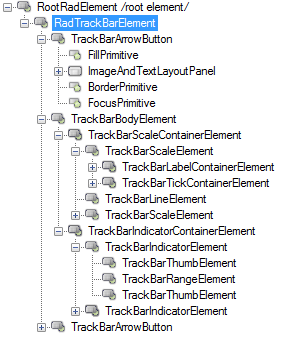
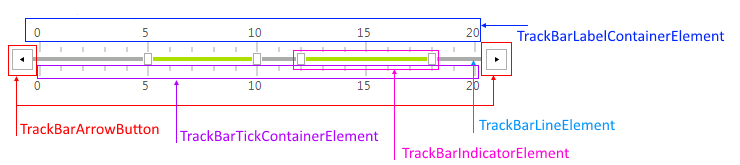

# Structure

This article illustrates the inner structure and organization of the elements which build the **RadTrackBar** control.

>caption Figure 1: RadTrackBar's elements hierarchy

>caption Figure 2: RadTrackBar's visual structure

 
Here is a brief explanation of the various elements in the tree:      

* The __RadTrackBarElement__ represents the entire __RadTrackBar__ control.  It contains two instances of __TrackArrowButtons__ that represent the handlers (buttons) and the __TrackBarBodyElement__.         

* __TrackBarBodyElement__ wraps and arranges __TrackBarScaleContainerElement__ and  __TrackBarIndicatorContainerElement__.            

* __TrackBarScaleContainerElement__ wraps and arranges the __TrackBarScaleElement__ and __TrackBarLineElement__.            

* Each instance of __TrackBarScaleElement__ contains its own set of __TrackBarTickContainerElement__  and __TrackBarLabelContainerElement__ that generates and arranges the ticks and labels respectively.          

* __TrackBarIndicatorContainerElement__ generates and arranges the __TrackbarIndicatorElements__ according the [mode]() of **RadTrackBar** and the content of the __Ranges__  collection. This class creates a connection between the logical __TrackBarRange__ and its visual representation - __TrackBarIndicatorElements__.           

* __TrackBarIndicatorElements__ represent a set of __TrackBarThumbElement__ and __TrackBarRangeElement__. This set represents two thumbs and a line between them.

# See Also

* [RadControlSpy]()
* [Getting Started]()	
* [Design Time]()

            
