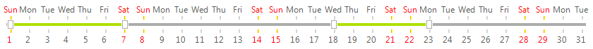

# Customization

**RadTrackBar** introduces the **TickFormatting** and **LableFormatting** events in order to facilitate the standard customization through the element tree of the control. Below you will find a scenario that will increase your knowledge about **RadTrackBar**'s API. Basically, we will customize **RadTrackBar** to use it as a selection tool for dates in a month:



#### Dates selection example

{{source=..\SamplesCS\TrackAndStatus\TrackBar\TrackBarCustomization.cs region=calendarExample}} 
{{source=..\SamplesVB\TrackAndStatus\TrackBar\TrackBarCustomization.vb region=calendarExample}} 

````C#
public TrackBarCustomization()
{
    InitializeComponent();
    this.radTrackBar1.Maximum = DateTime.DaysInMonth(DateTime.Now.Year, DateTime.Now.Month);
    this.radTrackBar1.Minimum = 1;
    this.radTrackBar1.LargeTickFrequency = 1;
    this.radTrackBar1.LabelStyle = Telerik.WinControls.UI.TrackBarLabelStyle.Both;
    this.radTrackBar1.TrackBarMode = Telerik.WinControls.UI.TrackBarRangeMode.Range;
    this.radTrackBar1.Ranges[0].End = 7;
    this.radTrackBar1.Ranges.Add(new Telerik.WinControls.UI.TrackBarRange(18, 23));
    this.radTrackBar1.TickFormatting += new Telerik.WinControls.UI.TickFormattingEventHandler(radTrackBar1_TickFormatting);
    this.radTrackBar1.LabelFormatting += new Telerik.WinControls.UI.LabelFormattingEventHandler(radTrackBar1_LabelFormatting);
}
void radTrackBar1_TickFormatting(object sender, TickFormattingEventArgs e)
{
    //since the ticks are zero-bazed, just add 1 to simulate days
    int day = e.TickNumber + 1;
    DateTime dt = new DateTime(DateTime.Now.Year, DateTime.Now.Month, day);
    //color sat & sun
    if (dt.DayOfWeek == DayOfWeek.Sunday || dt.DayOfWeek == DayOfWeek.Saturday)
    {
        e.TickElement.Line1.BackColor = Color.Orange;
        e.TickElement.Line2.BackColor = Color.Yellow;
    }
    //offset the bottom ticket
    if (e.TickElement.IsTopLeft)
    {
        e.TickElement.PositionOffset = new SizeF(0, 5);
    }
    //set the minimum size of the ticks
    e.TickElement.MinSize = new Size(2, 5);
}
void radTrackBar1_LabelFormatting(object sender, LabelFormattingEventArgs e)
{
    DateTime dt = new DateTime(DateTime.Now.Year, DateTime.Now.Month, int.Parse(e.LabelElement.Text));
    //colorize the sat & sun
    if (dt.DayOfWeek == DayOfWeek.Sunday || dt.DayOfWeek == DayOfWeek.Saturday)
    {
        e.LabelElement.ForeColor = Color.Red;
    }
    //make the top labels display the days
    if (e.LabelElement.IsTopLeft)
    {
        e.LabelElement.Text = dt.ToString("ddd", new CultureInfo("en-US"));
    }
}

````
````VB.NET
Public Sub New()
    InitializeComponent()
    Me.RadTrackBar1.Maximum = DateTime.DaysInMonth(DateTime.Now.Year, DateTime.Now.Month)
    Me.RadTrackBar1.Minimum = 1
    Me.RadTrackBar1.LargeTickFrequency = 1
    Me.RadTrackBar1.LabelStyle = Telerik.WinControls.UI.TrackBarLabelStyle.Both
    Me.RadTrackBar1.TrackBarMode = Telerik.WinControls.UI.TrackBarRangeMode.Range
    Me.RadTrackBar1.Ranges(0).[End] = 7
    Me.RadTrackBar1.Ranges.Add(New Telerik.WinControls.UI.TrackBarRange(18, 23))
    AddHandler Me.RadTrackBar1.TickFormatting, AddressOf radTrackBar1_TickFormatting
    AddHandler Me.RadTrackBar1.LabelFormatting, AddressOf radTrackBar1_LabelFormatting
End Sub
Private Sub radTrackBar1_TickFormatting(sender As Object, e As TickFormattingEventArgs)
    'since the ticks are zero-bazed, just add 1 to simulate days
    Dim day As Integer = e.TickNumber + 1
    Dim dt As New DateTime(DateTime.Now.Year, DateTime.Now.Month, day)
    'color sat & sun
    If dt.DayOfWeek = DayOfWeek.Sunday OrElse dt.DayOfWeek = DayOfWeek.Saturday Then
        e.TickElement.Line1.BackColor = Color.Orange
        e.TickElement.Line2.BackColor = Color.Yellow
    End If
    'offset the bottom ticket
    If e.TickElement.IsTopLeft Then
        e.TickElement.PositionOffset = New SizeF(0, 5)
    End If
    'set the minimum size of the ticks
    e.TickElement.MinSize = New Size(2, 5)
End Sub
Private Sub radTrackBar1_LabelFormatting(sender As Object, e As LabelFormattingEventArgs)
   Dim dt As New DateTime(DateTime.Now.Year, DateTime.Now.Month, Integer.Parse(e.LabelElement.Text))
    'colorize the sat & sun
    If dt.DayOfWeek = DayOfWeek.Sunday OrElse dt.DayOfWeek = DayOfWeek.Saturday Then
        e.LabelElement.ForeColor = Color.Red
    End If
    'make the top labels display the days
    If e.LabelElement.IsTopLeft Then
        e.LabelElement.Text = dt.ToString("ddd", New CultureInfo("en-US"))
    End If
End Sub

````

{{endregion}}

# See Also

* [Themes]()	
* [Accessing and Customizing Elements]()