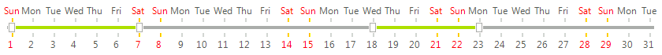

# Customization

**RadTrackBar** introduces the **TickFormatting** and **LableFormatting** events in order to facilitate the standard customization through the element tree of the control. Below you will find a scenario that will increase your knowledge about **RadTrackBar**'s API. Basically, we will customize **RadTrackBar** to use it as a selection tool for dates in a month:

#### Dates selection example

<snippet id='track-and-status-controls-trackbarcustomization-calendarexample-cs' />
<snippet id='track-and-status-controls-trackbarcustomization-calendarexample-vb' />

# See Also

* [Themes]()	
* [Accessing and Customizing Elements]()
