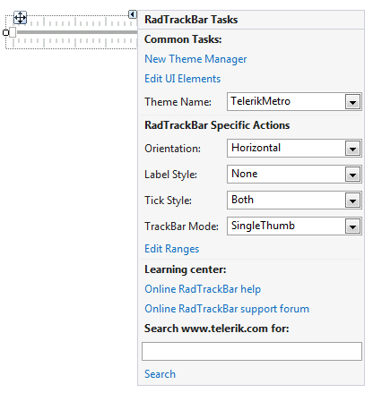
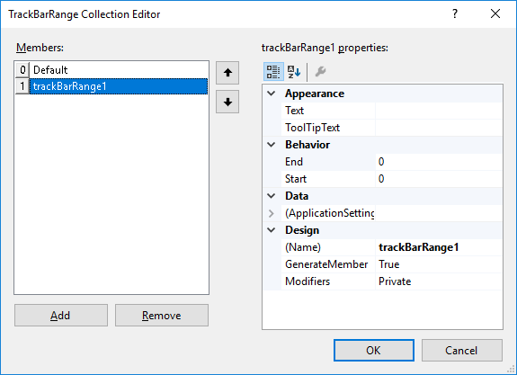

# Design Time

To start using **RadTrackBar** just drag it from the toolbox and drop it at the form.
 
## Smart Tag

Select **RadTrackBar** and click the small arrow on the top right position in order to open the __Smart Tag__. The __Smart Tag__ for **RadTrackBar** lets you quickly access common tasks involved with building **RadTrackBar** elements and customizing appearance through themes.

>caption Figure 1: Smart Tag

* __New Theme Manager__: adds a new __RadThemeManager__ component to the form.
            
* __Edit UI Elements__: allows setting properties at multiple levels of the class hierarchy.
            
* __Theme Name__: specifies the applied theme.

* __Orientation__: gets or sets the orientation of the **RadTrackBar**.
            
* __Label Style__: gets or sets whether the **RadTrackBar**'s labels should be drawn and specifies the style.

* __Tick Style__: gets or sets whether the **RadTrackBar**'s ticks should be drawn and specifies the style.

* __TrackBar Mode__: gets or Sets the Mode of the **RadTrackBar**.

* __Edit Ranges__: opens the *TrackBarRabge Collection Editor*.

           
* __Learning Center__: Navigate to the Telerik help, code library projects or support forum.

* __Search__: Search the Telerik site for a given string.         
        
# See Also

* [Element Hierarchy Editor]()
* [Using default themes]()
* [Getting Started]()	
