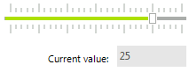

# Getting Started

This tutorial demonstrates connecting a **RadTrackBar** to a **RadTextBox** control. Setting the track bar slider position changes the value in the text box.
        

1. Place a __RadTrackBar__, __RadTextBox__ and __RadLabel__ controls on a form.
            

1. Select the __RadLabel__ control and set its **Text** property to "*Current Value:*".
            

1. Select the __RadTrackBar__ control and set the __Maximum__ property to __30__.
            

1. Click the __Events__ toolbar button in the *Properties* window.
            

1. Double-click the __ValueChanged__ event.
            

1. Replace the automatically-generated event handler with the following code:

{{source=..\SamplesCS\TrackAndStatus\TrackBar\TrackGettingStarted.cs region=valueChanged}} 
{{source=..\SamplesVB\TrackAndStatus\TrackBar\TrackGettingStarted.vb region=valueChanged}} 

````C#
void radTrackBar1_ValueChanged(object sender, EventArgs e)
{
    this.radTextBox1.Text = radTrackBar1.Value.ToString();
}

````
````VB.NET
Private Sub radTrackBar1_ValueChanged(ByVal sender As Object, ByVal e As EventArgs)
    Me.radTextBox1.Text = radTrackBar1.Value.ToString()
End Sub

````

{{endregion}} 

8\. Press __F5__ to run the project.

9\. Move the slider on the track bar using the mouse. The text box will update to show the new slider position.



# See Also

* [Structure]()	
* [Design Time]() 
