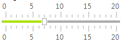
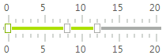
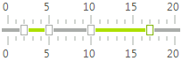

# Modes

**RadTrackBar** supports three different modes - *SingleThumb*, *StartFromTheBeginning* and *Range*. Each of these modes defines its own functionality and behavior. You can change the mode of the control via its __TrackBarMode__ property.
      
## SingleThumb

In this mode **RadTrackBar** works like a standard **TrackBar**. It contains one thumb and its value can be accessed through the __Value__ property of **RadTrackBar**. To receive notification when value is changed you can use the __ValueChanged__ event.

>caption Figure 1: SingleThumb

## StartFromTheBeginning

In this mode **RadTrackBar** looks like **RadTrackBar** in *SingleThumb* mode, but it can contain more than one thumb. To show more than one thumb you should add the desired ranges (__TrackBarRange__) in the __Ranges__ collection of control. For example:

<snippet id='track-and-status-controls-trackbarpropertiesandevents-trackbarmodestartfromthebeginning-cs' />
<snippet id='track-and-status-controls-trackbarpropertiesandevents-trackbarmodestartfromthebeginning-vb' />

In order to access the values of the thumbs in this mode you should go through the __Ranges__ collection and check the values of each __TrackBarRange__. Please, note that even though __TrackBarRange__ has both __Start__ and __End__ properties, in this mode **RadTrackBar** uses only the __End__ property, so you should access it in order to take the value of some range.

<snippet id='track-and-status-controls-trackbarpropertiesandevents-accessvaluesstartfromthebeginningmode-cs' />
<snippet id='track-and-status-controls-trackbarpropertiesandevents-accessvaluesstartfromthebeginningmode-vb' />

To receive notification when the **Value** is changed in this mode, you should use the __RangeValueChanged__ event of the __RadTrackBar__:

<snippet id='track-and-status-controls-trackbarpropertiesandevents-ranges_collectionchangedevent-cs' />
<snippet id='track-and-status-controls-trackbarpropertiesandevents-ranges_collectionchangedevent-vb' />

## Range

This mode allows you to define one or more __Ranges__ with __Start__ and __End__ values.  In this mode there the __Ranges__ cannot to overlap each other. To display a second range, you should add the desired __Range (TrackBarRange)__ in the __Ranges__ collection of the control. For example:

<snippet id='track-and-status-controls-trackbarpropertiesandevents-trackbarmoderange-cs' />
<snippet id='track-and-status-controls-trackbarpropertiesandevents-trackbarmoderange-vb' />

To receive notification when the **Value** is changed in this mode, you should use the __RangeValueChanged__ event of the RadTrackBar:

<snippet id='track-and-status-controls-trackbarpropertiesandevents-ranges_collectionchangedevent-cs' />
<snippet id='track-and-status-controls-trackbarpropertiesandevents-ranges_collectionchangedevent-vb' />

>important The __Ranges__ collection of **RadTrackBar** contains one default range that is used to display a default range for all modes. This collection should always contain at least one range, so if you execute the *Clear* method of the collection all ranges except the first one will be removed.
>

>note When the mode is changed from __StartFromTheBeginning__ to something else, the __Ranges__ collection will be reset to prevent overlappings that are not allowed in the other modes.
>

# See Also

* [Structure]()	
* [Design Time]()
* [Getting Started]()	
* [Properties and Events]()	
