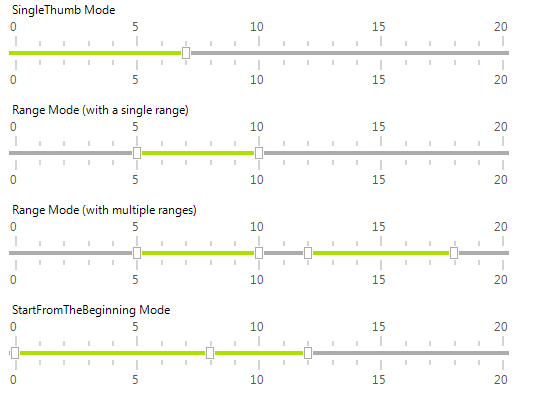

# TrackBar

__RadTrackBar__, sometimes called a slider control, can be used for navigating a large amount of information or for visually adjusting a numeric setting. __RadTrackBar__ consists of a horizontal or vertical bar with a sliding handle that can be moved with the mouse and a series of marks. Each mark represents a particular value that the trackbar can return.





# Key features

* Ticks and scale customization
* Multiple ranges
* Orientation 
* Value limits
* Snap mode
* Negative values support

# See Also

* [Structure]()	
* [Design Time]()
* [Getting Started]()	
