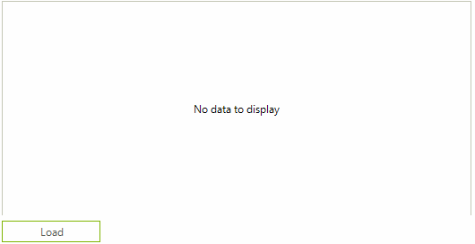

# Associated Control

__RadWaitingBar__ allows you to associate it to any control indicating its load time.

>caption Fig.1 Load indication

 

The following tutorial demonstrates how to indicate the data loading operation in __RadGridView__.

>caption Fig.2 Load data

 

1. Add __RadWaitingBar__, __RadGridView__ and __RadButton__ to the form.
2. Subscribe to the __Click__ event of __RadButton__ and set the RadWaitingBar.__AssociatedControl__ property to the grid. Thus, the waiting bar will be displayed over the grid while data is loading. After the data is loaded, set the __AssociatedControl__ property to *null*. Use the following code snippet:

#### Data loading

<snippet id='track-and-status-controls-waitingbarassociatedcontrol-busyindicator-cs' />
<snippet id='track-and-status-controls-waitingbarassociatedcontrol-busyindicator-vb' />

