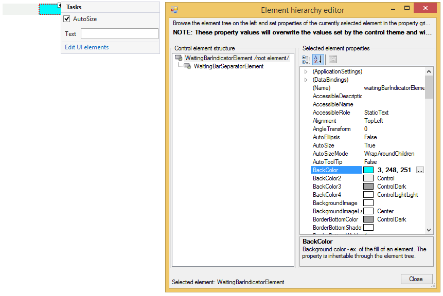
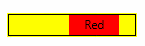
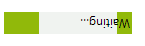

# Accessing and Customizing Elements

Accessing and customizing elements can be performed either at design time, or at run time. Before proceeding with this topic, it is recommended to get familiar with the [visual structure]() of __RadWaitingBar__.

## Design Time

You can access and modify the style for different elements in __RadWaitingBar__ by using the Element hierarchy editor.

>caption Fig.1 Element hierarchy editor

## Programmatically

You can customize the nested elements at run time as well:
>caption Fig.2 Customize elements

#### Customize elements 

<snippet id='track-and-status-controls-customizingradwaitingbar-accessingcustomizingelements-cs' />
<snippet id='track-and-status-controls-customizingradwaitingbar-accessingcustomizingelements-vb' />

## Customizing RadWaitingBar

__RadWaitingBar__ introduces a rich API which allows you to easily customize the visual appearance of __RadWaitingBar__ programmatically. Below you will find scenarios that will increase your knowledge about __RadWaitingBar__'s API, hence you will be able to customize it according to your requirements.      
      

### How to customize the text of RadWaitingBar

The text of __RadWaitingBar__ is not displayed by default. To show the text, set the __ShowText__ property of __RadWaitingBar__ to *true*.  To change the text content, use the __Text__ property of __RadWaitingBar__. To customize the text orientation, set the __AngleTransform__ property of the RadWaitingBarElement.__TextElement__. To modify the text position, change the __TextAlignment__ property of RadWaitingBarElement.__TextElement__. Here is a sample snippet:

#### Customize the text of RadWaitingBar

<snippet id='track-and-status-controls-customizingradwaitingbar-text-cs' />
<snippet id='track-and-status-controls-customizingradwaitingbar-text-vb' />

### How to customize RadWaitingBar’s Dash style 

To set the __RadWaitingBar__ in dash style, set the __WaitingStyle__ property to *Dash*.  To customize the appearance of the stripes-pattern, you need to access the RadWaitingBarElement.__SeparatorElement__. Here is a sample scenario:

#### Customize RadWaitingBar’s Dash style 

<snippet id='track-and-status-controls-customizingradwaitingbar-dash-cs' />
<snippet id='track-and-status-controls-customizingradwaitingbar-dash-vb' />

### How to set Dash style only for the waiting indicators

The waiting indicators also support dash style. To customize the appearance of the indicators’ stripes-pattern, you need to access the __SeparatorElements__ of all indicators. By default, the __WaitingIndicators__ collection contains two indicators. Here is a sample scenario:

#### Waiting indicators' Dash style

<snippet id='track-and-status-controls-customizingradwaitingbar-waitingindicators-cs' />
<snippet id='track-and-status-controls-customizingradwaitingbar-waitingindicators-vb' />

### How to customize the shape of RadWatingBar

Different shapes can be applied to both the __WaitingBarElement__ and the waiting indicator. In the following example the __WaitingBarElement__ and the waiting indicator have elliptical shape:

#### Customize the shape of RadWatingBar

<snippet id='track-and-status-controls-customizingradwaitingbar-shape-cs' />
<snippet id='track-and-status-controls-customizingradwaitingbar-shape-vb' />

# See Also

* [Themes]()	
