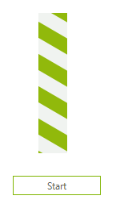
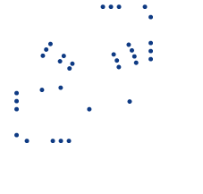

# Getting Started

* To add a __RadWaitingBar__ to your form, drag a __RadWaitingBar__ from the toolbox onto the surface of the form designer.

* To programmatically add a __RadWaitingBar__ to a form, create a new instance of a __RadWaitingBar__, and add it to the form __Controls__ collection.

#### Adding a RadWaitingBar at runtime

{{source=..\SamplesCS\TrackAndStatus\WaitingBar\WaitingGettingStarted.cs region=AddWaitingBar}} 
{{source=..\SamplesVB\TrackAndStatus\WaitingBar\WaitingGettingStarted.vb region=AddWaitingBar}} 

````C#
RadWaitingBar radWaitingBar = new RadWaitingBar();
radWaitingBar.WaitingStyle = Telerik.WinControls.Enumerations.WaitingBarStyles.Dash;
radWaitingBar.WaitingDirection = ProgressOrientation.Left;
this.Controls.Add(radWaitingBar);

````
````VB.NET
Dim radWaitingBar As New RadWaitingBar()
radWaitingBar.WaitingStyle = Telerik.WinControls.Enumerations.WaitingBarStyles.Dash
radWaitingBar.WaitingDirection = ProgressOrientation.Left
Me.Controls.Add(radWaitingBar)

````

{{endregion}} 


The following tutorial illustrates how to start and stop the animation of __RadWaitingBar__:


1\. Place a __RadWaitingBar__ control and a __RadButton__ control on a form.

2\. Select the __RadWaitingBar__ control.

3\. In the __Properties__ window set the __WaitingDirection__ property to *Bottom*.

4\. Resize the __RadWaitingBar__ so that its height is larger than its width.

5\. Select the __RadButton__ control.

6\. Set the __Text__ property to *Start*.

7\. In the __Properties__ window click the events button.

8\. Double-click the __Click__ event.

9\. Replace the automatically-generated event handler with this code:

#### RadButton's Click event handler

{{source=..\SamplesCS\TrackAndStatus\WaitingBar\WaitingGettingStarted.cs region=click}} 
{{source=..\SamplesVB\TrackAndStatus\WaitingBar\WaitingGettingStarted.vb region=click}} 

````C#
private void radButton1_Click(object sender, EventArgs e)
{
    if (radWaitingBar1.IsWaiting)
    {
        radWaitingBar1.StopWaiting();
        this.radButton1.Text = "Start";
    }
    else
    {
        radWaitingBar1.StartWaiting();
        this.radButton1.Text = "Stop";
    }
}

````
````VB.NET
Private Sub radButton1_Click(ByVal sender As Object, ByVal e As EventArgs)
    If RadWaitingBar1.IsWaiting Then
        RadWaitingBar1.StopWaiting()
        Me.RadButton1.Text = "Start"
    Else
        RadWaitingBar1.StartWaiting()
        Me.RadButton1.Text = "Stop"
    End If
End Sub

````

{{endregion}} 

10\. Press __F5__ to run the project.

11\. Click the *Start* button to start and stop the animation.



## Adding Indicator Elements programmatically

The following example demonstrates how to add __DotsLineWaitingBarIndicatorElements__ in a __RadWaitingBar__ with WaitingBarStyles.*DotsSpinner*:



{{source=..\SamplesCS\TrackAndStatus\WaitingBar\CustomizingRadWaitingBar.cs region=AddingIndicators}} 
{{source=..\SamplesVB\TrackAndStatus\WaitingBar\CustomizingRadWaitingBar.vb region=AddingIndicators}} 

````C#
RadWaitingBar radWaitingBar1 = new RadWaitingBar();
radWaitingBar1.Size = new System.Drawing.Size(200, 200);
radWaitingBar1.WaitingStyle = Telerik.WinControls.Enumerations.WaitingBarStyles.DotsSpinner;
radWaitingBar1.StartWaiting();
int radius = 20;
int elementCount = 5;
for (int i = 0; i < 4; i++)
{
    radius += 10;
    elementCount += 1;
    DotsSpinnerWaitingBarIndicatorElement dsi = new DotsSpinnerWaitingBarIndicatorElement();
    radWaitingBar1.WaitingIndicators.Add(dsi);
    dsi.Radius = radius;
    dsi.ElementCount = elementCount;
    dsi.RotationDirection = (RotationDirection)(i % 2);
}
DotsLineWaitingBarIndicatorElement dli = new DotsLineWaitingBarIndicatorElement();
radWaitingBar1.WaitingIndicators.Add(dli);
dli.PositionOffset = new SizeF(0, 50);
DotsLineWaitingBarIndicatorElement dli1 = new DotsLineWaitingBarIndicatorElement();
radWaitingBar1.WaitingIndicators.Add(dli1);
dli1.WaitingDirection = Telerik.WinControls.ProgressOrientation.Left;
dli1.PositionOffset = new SizeF(0, -50);
DotsLineWaitingBarIndicatorElement dli2 = new DotsLineWaitingBarIndicatorElement();
radWaitingBar1.WaitingIndicators.Add(dli2);
dli2.WaitingDirection = Telerik.WinControls.ProgressOrientation.Bottom;
dli2.PositionOffset = new SizeF(50, 0);
DotsLineWaitingBarIndicatorElement dli4 = new DotsLineWaitingBarIndicatorElement();
radWaitingBar1.WaitingIndicators.Add(dli4);
dli4.WaitingDirection = Telerik.WinControls.ProgressOrientation.Top;
dli4.PositionOffset = new SizeF(-50, 0);
radWaitingBar1.Location = new Point(10, 10);
this.Controls.Add(radWaitingBar1);
radWaitingBar1.StartWaiting();

````
````VB.NET
Dim radWaitingBar1 As New RadWaitingBar()
radWaitingBar1.Size = New System.Drawing.Size(200, 200)
radWaitingBar1.WaitingStyle = Telerik.WinControls.Enumerations.WaitingBarStyles.DotsSpinner
radWaitingBar1.StartWaiting()
Dim radius As Integer = 20
Dim elementCount As Integer = 5
For i As Integer = 0 To 3
    radius += 10
    elementCount += 1
    Dim dsi As New DotsSpinnerWaitingBarIndicatorElement()
    radWaitingBar1.WaitingIndicators.Add(dsi)
    dsi.Radius = radius
    dsi.ElementCount = elementCount
    dsi.RotationDirection = DirectCast(i Mod 2, RotationDirection)
Next
Dim dli As New DotsLineWaitingBarIndicatorElement()
radWaitingBar1.WaitingIndicators.Add(dli)
dli.PositionOffset = New SizeF(0, 50)
Dim dli1 As New DotsLineWaitingBarIndicatorElement()
radWaitingBar1.WaitingIndicators.Add(dli1)
dli1.WaitingDirection = Telerik.WinControls.ProgressOrientation.Left
dli1.PositionOffset = New SizeF(0, -50)
Dim dli2 As New DotsLineWaitingBarIndicatorElement()
radWaitingBar1.WaitingIndicators.Add(dli2)
dli2.WaitingDirection = Telerik.WinControls.ProgressOrientation.Bottom
dli2.PositionOffset = New SizeF(50, 0)
Dim dli4 As New DotsLineWaitingBarIndicatorElement()
radWaitingBar1.WaitingIndicators.Add(dli4)
dli4.WaitingDirection = Telerik.WinControls.ProgressOrientation.Top
dli4.PositionOffset = New SizeF(-50, 0)
radWaitingBar1.Location = New Point(10, 10)
Me.Controls.Add(radWaitingBar1)
radWaitingBar1.StartWaiting()

````

{{endregion}}

# See Also

* [Structure]()	
* [Design Time]()
